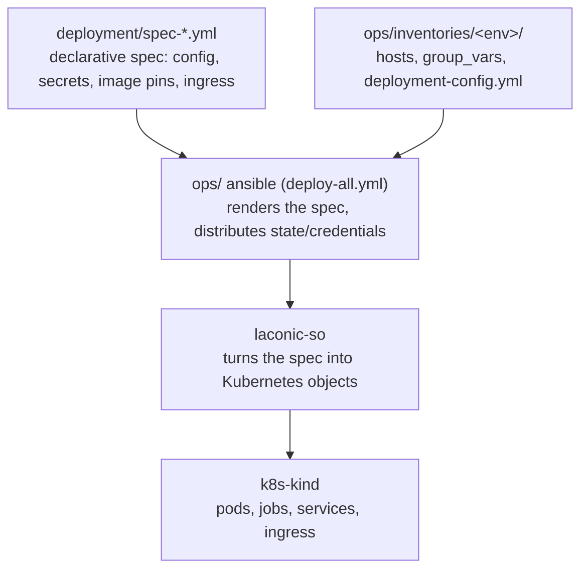

# Hyperlane SVM Bridge Stacks

Stack-orchestrator (`laconic-so`) stacks for deploying and operating a Hyperlane
cross-chain token bridge between **Gorchain** and **Solana**: contract deployers,
validators, relayer, gas oracle, monitoring, and a browser-based bridge UI — all
packaged for `k8s-kind` deployment and driven from an ansible ops layer.

This README is the entry point for anyone taking over the deployment: it explains
the repository, the components, how deployments work, and how to operate and
change them. Each section links to the deeper reference docs and runbooks.

## Live endpoints

| | Production | Staging |
|---|---|---|
| Bridge UI | https://bridge.gorbagana.wtf | https://staging.gorbagana.wtf |
| Explorer¹ | https://explorer.bridge.gorbagana.wtf | https://explorer.staging.gorbagana.wtf |
| Grafana | https://grafana.bridge.gorbagana.wtf | https://grafana.staging.gorbagana.wtf |
| Prometheus | https://prometheus.bridge.gorbagana.wtf | https://prometheus.staging.gorbagana.wtf |
| Gorchain RPC | https://rpc.gorbagana.wtf | https://rpc.staging.gorbagana.wtf |

¹ The explorer is a separate application under active development in its own
repository; the deployment stack and these URLs are placeholders to be wired up
when it lands.

## Repository layout

- `stack_orchestrator/` — the stacks themselves: stack definitions (`data/stacks/`),
  compose files (`data/compose/`, `data/compose-jobs/`), config sources
  (`data/config/`), and container builds (`data/container-build/`)
- `deployment/` — per-environment deployment **specs** and warp-route menus
  (prod at the root, `staging/`, `local/`). These are the declarative inputs that
  describe each deployment.
- `ops/` — the ansible deploy layer (`inventories/`, `playbooks/`, `roles/`,
  `scripts/`) and the operator [`runbooks/`](ops/runbooks/). This is how a bridge
  is actually brought up and operated.
- `hyperlane-kms-proxy/` — Privy KMS proxy sidecar (Go), source for the
  `hyperlane-kms-proxy` image
- `hyperlane-gas-oracle/` — gas oracle service (Node.js), source for the
  `hyperlane-gas-oracle` image
- `tests/` — test suites (`e2e/` pytest, `unit/`)
- `docs/` — architecture decisions, stack/ops specifications, and the
  [development guide](docs/development.md) for changing and releasing the app images
- `CLAUDE.md` — machine-readable map of the repo and its keep-in-sync rules;
  read it first when using an AI assistant to make changes here

## Repos and images

The stacks run container images published to `ghcr.io/gorbagana-dev/`. Some are
built from upstream Hyperlane sources pinned by commit; one is built from our own
fork; two are built from services that live in this repo.

| Image (`ghcr.io/gorbagana-dev/…`) | Built from | Kind | Used by |
|---|---|---|---|
| `hyperlane-agent` | `hyperlane-xyz/hyperlane-monorepo` @ pinned commit | upstream pin | validator, relayer |
| `hyperlane-svm-deployer` | `hyperlane-xyz/hyperlane-monorepo` @ pinned commit + `hyperlane-xyz/solana-program-library` | upstream pin | svm-deployer, warp-deployer |
| `hyperlane-kms-proxy` | `hyperlane-kms-proxy/` (this repo) | in-repo | validator, relayer (sidecar) |
| `hyperlane-gas-oracle` | `hyperlane-gas-oracle/` (this repo) | in-repo | gas-oracle |
| `hyperlane-warp-ui` | `gorbagana-dev/hyperlane-warp-ui-template` @ `vX.Y.Z-gorbagana.N` | **our fork** | warp-ui |
| explorer | separate repo (in progress) | placeholder | explorer |

The exact pins live in each stack's `stack_orchestrator/data/stacks/<stack>/stack.yml`
(`repos:` for upstream/fork sources). Images are built and published by CI —
see the [development guide](docs/development.md) for the full change → release →
publish → deploy flow (this is the path you follow to reskin the warp UI or the
explorer from Hyperlane branding to Gorbagana).

## Stacks

Each stack has its own README under `stack_orchestrator/data/stacks/<stack>/`.

| Stack | Description |
|---|---|
| [hyperlane-minio](stack_orchestrator/data/stacks/hyperlane-minio/) | S3-compatible storage for validator checkpoints |
| [hyperlane-svm-deployer](stack_orchestrator/data/stacks/hyperlane-svm-deployer/) | Deploys Hyperlane core contracts on both chains |
| [hyperlane-svm-warp-deployer](stack_orchestrator/data/stacks/hyperlane-svm-warp-deployer/) | Deploys warp route contracts for the selected token pairs |
| [hyperlane-validator](stack_orchestrator/data/stacks/hyperlane-validator/) | Validator + Privy KMS proxy (one deployment per chain) |
| [hyperlane-relayer](stack_orchestrator/data/stacks/hyperlane-relayer/) | Cross-chain message relayer with IGP fee-claim sidecar |
| [hyperlane-gas-oracle](stack_orchestrator/data/stacks/hyperlane-gas-oracle/) | Periodically updates IGP gas oracle configs |
| [hyperlane-monitoring](stack_orchestrator/data/stacks/hyperlane-monitoring/) | Prometheus, Grafana, pushgateway, balance monitor |
| [hyperlane-warp-ui](stack_orchestrator/data/stacks/hyperlane-warp-ui/) | Browser-based bridge UI |

### Deployment order

1. `hyperlane-minio` — checkpoint storage
2. `hyperlane-svm-deployer` — core contracts (writes state consumed by all downstream stacks)
3. `hyperlane-svm-warp-deployer` — warp route contracts
4. `hyperlane-validator` (gorchain) + `hyperlane-validator` (solana) — one deployment per chain
5. `hyperlane-relayer` — message delivery
6. `hyperlane-gas-oracle`, `hyperlane-monitoring`, `hyperlane-warp-ui` — no ordering constraint

State flows from the deployer Jobs (which write JSON to a host `/state` path) into
each downstream stack's ConfigMaps at deploy time. The mechanics are in
[docs/architecture-decisions.md](docs/architecture-decisions.md) and `CLAUDE.md`.

## How deployments work

Deployments are **declarative**. The unit of truth for a deployment is its
**spec file** under `deployment/` (e.g. `deployment/spec-relayer.yml` for prod,
`deployment/staging/spec-relayer.yml` for staging). A spec names the stack, the
config and secret values, the ConfigMaps, the ingress hosts, and the pinned
container image. You do not deploy stacks by hand — the ops layer assembles each
stack's environment and runs `laconic-so` for you.

The flow, top to bottom:

**To change a deployment**, edit its spec (or the env's `deployment-config.yml`)
and re-run the relevant ops playbook — e.g. `restart-stack.yml` to roll one stack
with its current config, or `deploy-all.yml` for a full bring-up. Bump a pinned
image only by editing the spec's `image-overrides` (and the stack's `stack.yml`
source pin); see the [development guide](docs/development.md).

`ops/README.md` is the mechanics reference behind all of this — read it to
understand the configuration model, inventory/topology, and exactly what each
playbook does.

## Operating the bridge

Start from the **runbook** for your environment — each is a from-zero,
copy-runnable guide:

| Environment | Runbook | What it is |
|---|---|---|
| **staging** | [ops/runbooks/staging.md](ops/runbooks/staging.md) | Prod rehearsal: Solana devnet + a persistent single-node gorchain, real DNS/TLS, on three VMs |
| **prod** | [ops/runbooks/prod.md](ops/runbooks/prod.md) | Mainnet: external gorchain + Helius mainnet, single host under `bridge.gorbagana.wtf` |
| **local (single-host)** | [ops/runbooks/local-single-host.md](ops/runbooks/local-single-host.md) | Whole bridge + both chains on one VM, self-trusted certs |
| **local (multi-host)** | [ops/runbooks/local-multi-host.md](ops/runbooks/local-multi-host.md) | Multi-VM local topology |

Operational tasks have their own runbooks:

- **Monitoring & alerts** — [ops/runbooks/monitoring.md](ops/runbooks/monitoring.md):
  Grafana dashboards (links above) and the balance monitor that posts low-balance
  alerts to Slack (set `slack_webhook_url` in `deployment-config.yml`).
- **Warp routes** — [ops/runbooks/warp-routes.md](ops/runbooks/warp-routes.md):
  adding/selecting token routes from the checked-in menu.
- **Funding** — [ops/runbooks/funding-estimate.md](ops/runbooks/funding-estimate.md):
  what each signer needs and how to fund it.
- **Privy wallets** — [ops/runbooks/privy-wallets.md](ops/runbooks/privy-wallets.md):
  the server-wallet signing model.

## Documentation

- [Operator runbooks](ops/runbooks/) — from-zero deployment guides per environment
- [ops/ deploy layer](ops/README.md) — ansible mechanics reference
- [Development guide](docs/development.md) — changing, releasing, and publishing
  the app/agent images (warp UI, explorer, agents) and rolling them into deployments
- [Stack specifications](docs/stack-specifications.md) — detailed per-stack specs
- [Architecture decisions](docs/architecture-decisions.md) — design rationale and state flow
- [Ops decisions](docs/ops-decisions.md) — ops-layer design rationale
- [CLAUDE.md](CLAUDE.md) — repo map and keep-in-sync rules (read first when editing with an AI assistant)
