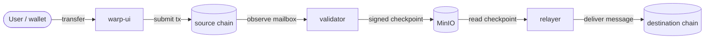
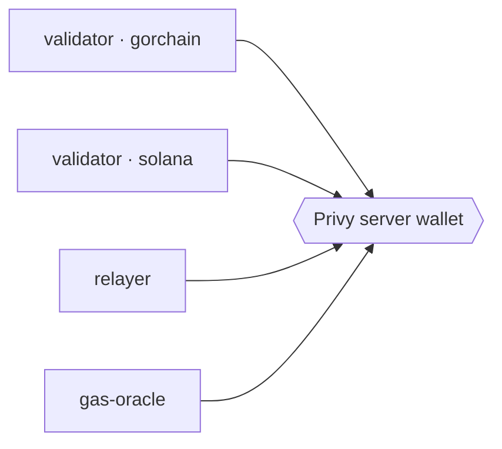
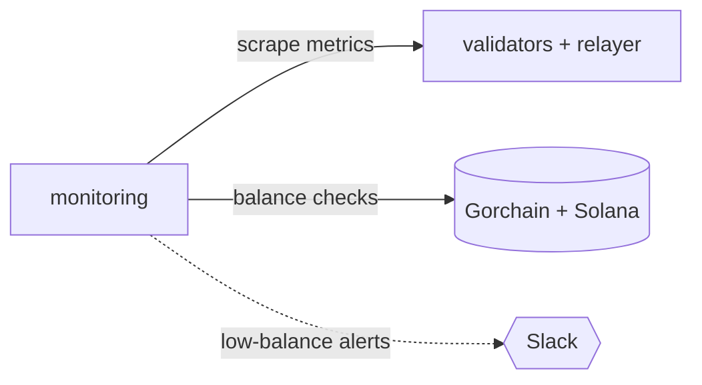
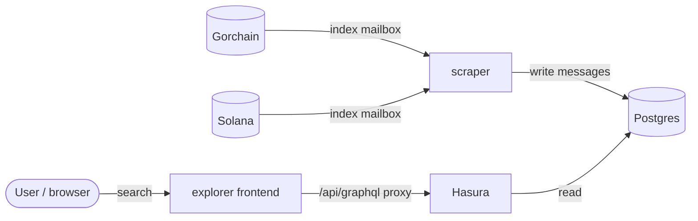
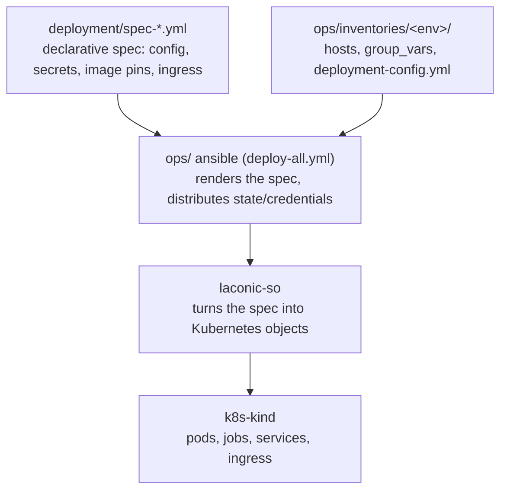

# Hyperlane SVM Bridge Stacks

Stack-orchestrator (`laconic-so`) stacks for deploying and operating a Hyperlane
cross-chain token bridge between **Gorchain** and **Solana**: contract deployers,
validators, relayer, gas oracle, monitoring, a message explorer, and a
browser-based bridge UI — all packaged for `k8s-kind` deployment and driven from
an ansible ops layer.

## Live endpoints (production)

- Bridge UI — https://bridge.gorbagana.wtf ([how to bridge tokens](docs/using-the-bridge.md))
- Explorer — https://explorer.bridge.gorbagana.wtf (bridge message search)
- Grafana — https://grafana.bridge.gorbagana.wtf
- Prometheus — https://prometheus.bridge.gorbagana.wtf
- Gorchain RPC — https://rpc.gorbagana.wtf

## Repository layout

```
hyperlane-stacks/
├── stack_orchestrator/        # the stacks themselves
│   └── data/
│       ├── stacks/            #   stack definitions (stack.yml per stack)
│       ├── compose/           #   compose files for long-running pods
│       ├── compose-jobs/      #   compose files for one-shot deployer jobs
│       ├── config/            #   config sources (scripts, templates)
│       └── container-build/   #   Dockerfiles + build scripts
├── deployment/                # per-env deployment specs + warp-route menus
│   ├── spec-*.yml             #   prod specs (declarative inputs per stack)
│   ├── staging/               #   staging overrides
│   └── local/                 #   local overrides
├── ops/                       # ansible deploy layer — how a bridge is brought up
│   ├── inventories/           #   per-env hosts, group_vars, deployment-config
│   ├── playbooks/             #   setup-all, deploy-all + per-step plays
│   ├── roles/                 #   building blocks (stack_deploy, credentials, …)
│   ├── scripts/               #   host-side helpers (chain setup, keys, funding)
│   └── runbooks/              #   from-zero operator guides — start here
├── hyperlane-kms-proxy/       # Privy KMS proxy sidecar (Go) → kms-proxy image
├── hyperlane-gas-oracle/      # gas oracle service (Node.js) → gas-oracle image
├── tests/                     # e2e (pytest) + unit suites
├── docs/                      # architecture/stack/ops specs + development guide
└── CLAUDE.md                  # repo map + keep-in-sync rules
```

## Repos and images

The stacks run container images published to `ghcr.io/gorbagana-dev/`. Each is
built either from an upstream Hyperlane source, from our own fork, or from a
service in this repo. The exact pins (fork release tags, upstream commits) live
in each stack's `stack_orchestrator/data/stacks/<stack>/stack.yml`.

| Image | Built from | Kind | Used by |
|---|---|---|---|
| [`hyperlane-agent`](https://github.com/orgs/gorbagana-dev/packages/container/package/hyperlane-agent) | [`hyperlane-monorepo`](https://github.com/gorbagana-dev/hyperlane-monorepo) | our fork | validator, relayer |
| [`hyperlane-svm-deployer`](https://github.com/orgs/gorbagana-dev/packages/container/package/hyperlane-svm-deployer) | [`hyperlane-monorepo`](https://github.com/hyperlane-xyz/hyperlane-monorepo) + [`solana-program-library`](https://github.com/hyperlane-xyz/solana-program-library) | upstream | svm-deployer, warp-deployer |
| [`hyperlane-kms-proxy`](https://github.com/orgs/gorbagana-dev/packages/container/package/hyperlane-kms-proxy) | [`hyperlane-kms-proxy/`](hyperlane-kms-proxy/) | in-repo | validator, relayer (sidecar) |
| [`hyperlane-gas-oracle`](https://github.com/orgs/gorbagana-dev/packages/container/package/hyperlane-gas-oracle) | [`hyperlane-gas-oracle/`](hyperlane-gas-oracle/) | in-repo | gas-oracle |
| [`hyperlane-warp-ui`](https://github.com/orgs/gorbagana-dev/packages/container/package/hyperlane-warp-ui) | [`hyperlane-warp-ui-template`](https://github.com/gorbagana-dev/hyperlane-warp-ui-template) | our fork | warp-ui |
| [`hyperlane-explorer`](https://github.com/orgs/gorbagana-dev/packages/container/package/hyperlane-explorer) | [`hyperlane-explorer`](https://github.com/gorbagana-dev/hyperlane-explorer) | our fork | explorer (frontend) |
| [`hyperlane-scraper`](https://github.com/orgs/gorbagana-dev/packages/container/package/hyperlane-scraper) | [`hyperlane-monorepo`](https://github.com/gorbagana-dev/hyperlane-monorepo) | our fork | explorer (indexer) |

Building and publishing these images, and rolling a new one into a deployment, is
covered in the [development guide](docs/development.md).

## Stacks

Each stack has its own README under `stack_orchestrator/data/stacks/<stack>/`.

| Stack | Description |
|---|---|
| [hyperlane-minio](stack_orchestrator/data/stacks/hyperlane-minio/) | S3-compatible storage for validator checkpoints |
| [hyperlane-svm-deployer](stack_orchestrator/data/stacks/hyperlane-svm-deployer/) | Deploys Hyperlane core contracts on both chains |
| [hyperlane-svm-warp-deployer](stack_orchestrator/data/stacks/hyperlane-svm-warp-deployer/) | Deploys warp route contracts for the selected token pairs |
| [hyperlane-validator](stack_orchestrator/data/stacks/hyperlane-validator/) | Validator + Privy KMS proxy (one deployment per chain) |
| [hyperlane-relayer](stack_orchestrator/data/stacks/hyperlane-relayer/) | Cross-chain message relayer with IGP fee-claim sidecar |
| [hyperlane-gas-oracle](stack_orchestrator/data/stacks/hyperlane-gas-oracle/) | Periodically updates IGP gas oracle configs |
| [hyperlane-monitoring](stack_orchestrator/data/stacks/hyperlane-monitoring/) | Prometheus, Grafana, pushgateway, balance monitor |
| [hyperlane-warp-ui](stack_orchestrator/data/stacks/hyperlane-warp-ui/) | Browser-based bridge UI |
| [hyperlane-explorer](stack_orchestrator/data/stacks/hyperlane-explorer/) | Message indexer + search UI (frontend, scraper, Hasura, Postgres) |

### Deployment order

1. `hyperlane-minio` — checkpoint storage
2. `hyperlane-svm-deployer` — core contracts (writes state consumed by all downstream stacks)
3. `hyperlane-svm-warp-deployer` — warp route contracts
4. `hyperlane-validator` (gorchain) + `hyperlane-validator` (solana) — one deployment per chain
5. `hyperlane-relayer` — message delivery
6. `hyperlane-gas-oracle`, `hyperlane-monitoring`, `hyperlane-warp-ui`, `hyperlane-explorer` — no ordering constraint

State flows from the deployer Jobs (which write JSON to a host `/state` path) into
each downstream stack's ConfigMaps at deploy time. The mechanics are in
[docs/architecture-decisions.md](docs/architecture-decisions.md) and `CLAUDE.md`.

## How the components interact

The deployer Jobs run first and seed contract addresses/config; once the
long-running stacks are up, four flows describe how they interact at runtime:
the bridge message path, signing and fees, monitoring, and message indexing.

### 1. Bridging a transfer

A transfer is submitted on the source chain through the UI; a validator observes
it and writes a signed checkpoint to MinIO; the relayer reads the checkpoint and
delivers the message on the destination chain.



Gorchain and Solana each run their own validator, and bridging works both ways —
"source" and "destination" swap with the direction of the transfer. The UI
submits on Gorchain directly and on Solana through its own server-side RPC proxy,
and links each transfer to the explorer for status.

### 2. Signing and fees

Every component that sends an on-chain transaction signs it through the Privy
server wallet — the validators (checkpoint announcements), the relayer (message
delivery and IGP fee claims), and the gas oracle (refreshing the interchain gas
payment fee configs on both chains).



### 3. Monitoring

Monitoring scrapes Prometheus metrics from the agents and checks signer balances
on-chain, posting low-balance alerts to Slack; Grafana visualizes the metrics.



### 4. Indexing and the explorer

The scraper indexes both chains' mailboxes into Postgres; Hasura serves a
read-only GraphQL API over the indexed data; the explorer frontend serves the
search UI and proxies the browser's GraphQL at a same-origin `/api/graphql`, so
Hasura and Postgres stay cluster-internal (only the frontend is public).



## How deployments work

Deployments are **declarative**. The unit of truth for a deployment is its
**spec file** under `deployment/` (e.g. `deployment/spec-relayer.yml` for prod,
`deployment/staging/spec-relayer.yml` for staging). A spec names the stack, the
config and secret values, the ConfigMaps, the ingress hosts, and the pinned
container image. You do not deploy stacks by hand — the ops layer assembles each
stack's environment and runs `laconic-so` for you.

The flow, top to bottom:



**To change a deployment**, edit its spec (or the env's `deployment-config.yml`)
and re-run the relevant ops playbook — e.g. `restart-stack.yml` to roll one stack
with its current config, or `deploy-all.yml` for a full bring-up. Bump a pinned
image only by editing the spec's `image-overrides` (and the stack's `stack.yml`
source pin); see the [development guide](docs/development.md).

`ops/README.md` is the mechanics reference behind all of this — read it to
understand the configuration model, inventory/topology, and exactly what each
playbook does.

## Operating the bridge

Start from the **runbook** for your environment — each is a from-zero,
copy-runnable guide:

| Environment | Runbook | What it is |
|---|---|---|
| **prod** | [ops/runbooks/prod.md](ops/runbooks/prod.md) | Mainnet: external gorchain + Helius mainnet, single host under `bridge.gorbagana.wtf` |
| **staging** | [ops/runbooks/staging.md](ops/runbooks/staging.md) | Prod rehearsal: Solana devnet + a persistent single-node gorchain, real DNS/TLS, on three VMs |
| **local (single-host)** | [ops/runbooks/local-single-host.md](ops/runbooks/local-single-host.md) | Whole bridge + both chains on one VM, self-trusted certs |

Operational tasks have their own runbooks:

- **Monitoring & alerts** — [ops/runbooks/monitoring.md](ops/runbooks/monitoring.md):
  Grafana dashboards (links above) and the balance monitor that posts low-balance
  alerts to Slack (set `slack_webhook_url` in `deployment-config.yml`).
- **Warp routes** — [ops/runbooks/warp-routes.md](ops/runbooks/warp-routes.md):
  adding/selecting token routes from the checked-in menu.
- **Funding** — [ops/runbooks/funding-estimate.md](ops/runbooks/funding-estimate.md):
  what each signer needs and how to fund it.
- **Privy wallets** — [ops/runbooks/privy-wallets.md](ops/runbooks/privy-wallets.md):
  the server-wallet signing model.

## Documentation

- [Using the bridge](docs/using-the-bridge.md) — end-user guide to bridging tokens in the UI
- [Operator runbooks](ops/runbooks/) — from-zero deployment guides per environment
- [ops/ deploy layer](ops/README.md) — ansible mechanics reference
- [Development guide](docs/development.md) — changing, releasing, and publishing
  the app/agent images (warp UI, explorer, agents) and rolling them into deployments
- [Stack specifications](docs/stack-specifications.md) — detailed per-stack specs
- [Architecture decisions](docs/architecture-decisions.md) — design rationale and state flow
- [Ops decisions](docs/ops-decisions.md) — ops-layer design rationale
- [CLAUDE.md](CLAUDE.md) — repo map and keep-in-sync rules (read first when editing with an AI assistant)
