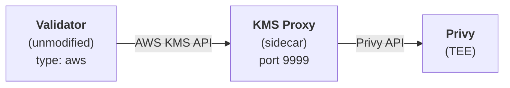
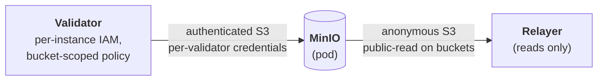
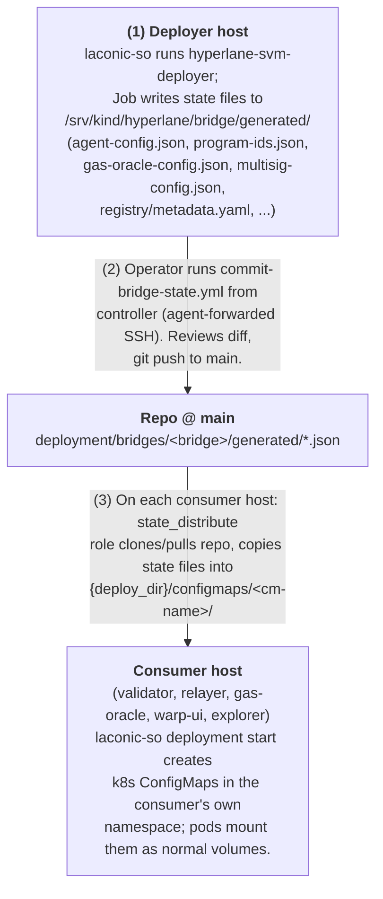
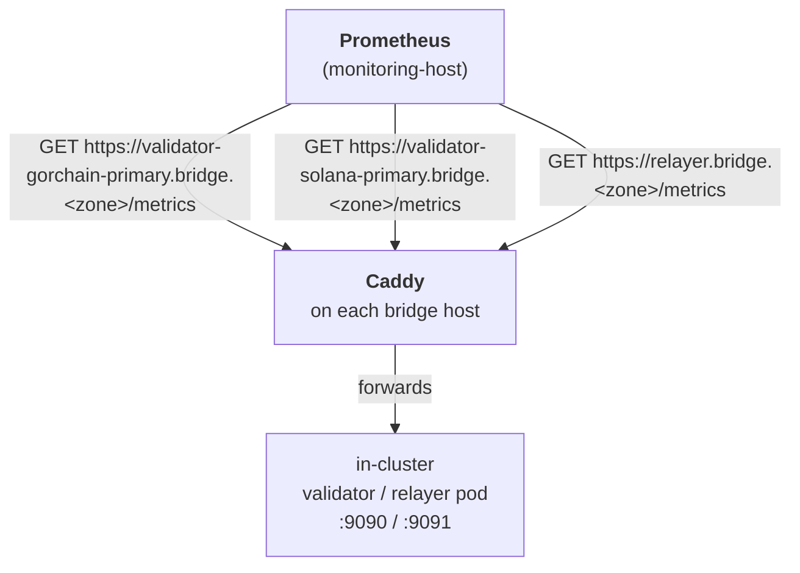

# Hyperlane SVM Bridge: Architecture Decisions

Decisions made during planning for the v1 laconic-so stacks. These inform the implementation spec.

---

## Stack Decomposition

**9 stacks** (each stack = one k8s Pod or set of k8s Jobs, see `docs/stack-specifications.md` for detailed per-stack specs):

| Stack | Type | Purpose |
|-------|------|---------|
| `hyperlane-svm-deployer` | One-time job | Deploys Hyperlane core contracts, configures IGP + Multisig ISM. Writes state files to a host-path volume. |
| `hyperlane-svm-warp-deployer` | One-time job | Deploys one configurable warp route per deployment, parameterized by per-route config fields (token-config built generically from those fields). Separate from core deployer to allow multiple warp routes against the same core deployment. |
| `hyperlane-validator` | Long-running | Runs a Hyperlane validator for one chain with KMS proxy sidecar for Privy signing. **One deployment per validator instance.** Multiple instances per chain supported via per-instance specs derived from `validators.yaml`. |
| `hyperlane-relayer` | Long-running | Delivers cross-chain messages. Includes IGP fee claim sidecar. |
| `hyperlane-minio` | Long-running | S3-compatible checkpoint storage (MinIO) for validators and relayer. Per-validator IAM users with bucket-scoped policies. |
| `hyperlane-gas-oracle` | Long-running | Automated IGP gas oracle updates via Privy. |
| `hyperlane-monitoring` | Long-running | Prometheus + Grafana + balance monitor. |
| `hyperlane-warp-ui` | Long-running (optional) | Browser-based bridge UI for token transfers. |
| `hyperlane-explorer` | Long-running (optional, stateful) | Self-hosted message indexer + search UI. Single pod of four services (Postgres, scraper, Hasura, Next.js frontend); only the frontend is publicly exposed. See §Explorer. |

**Rationale:** Stack-orchestrator maps all services in a stack to a single k8s Pod, so services needing independent lifecycles or restart must be separate stacks. Separating deployment from runtime allows re-running deployers independently, deploying multiple warp routes, and upgrading agents without redeploying contracts.

**Operator-attended on-chain operations** (kill-switch, restore, teardown, ISM update, fee claims, program closures) are **not** an SO stack. They run from the ansible/operator layer using the forked `hyperlane-sealevel-client` with built-in Ledger signing — see `docs/ops-decisions.md` and `docs/superpowers/specs/2026-05-29-ops-layer-redesign-and-ledger-signing-design.md`. (An earlier design used a `hyperlane-ops` stack of `laconic.suspend` jobs; that SO feature was built and merged but has no v1 consumer under the current design — it remains available as latent infrastructure.)

---

## Networking

**Decision:** Public internet for cross-host service-to-service traffic; in-cluster routing for everything on the same host.

### External RPCs

Both chains (Gorchain and Solana) are accessed via external RPC endpoints over the public internet. No VPN or host networking required.

### Cross-host bridge traffic

In multi-host production, stacks on different hosts reach each other via Caddy + public DNS. Each long-running stack with public endpoints declares them in its spec's `network.http-proxy:` block and Caddy auto-provisions LE certificates against `acme-email`. Consumers reach the endpoint by hostname (e.g. `https://s3.bridge.gorbagana.wtf` for MinIO).

This applies to:
- **MinIO** — validators write checkpoints and relayer reads them via `https://s3.bridge.<zone>`. Per-validator IAM authenticates writes; checkpoints are anonymously readable.
- **Monitoring** — Prometheus on the monitoring host scrapes `/metrics` over `https://validator-<label>.bridge.<zone>` and `https://relayer.bridge.<zone>`. v1 leaves these world-readable; v1.x adds basic auth.
- **Warp UI** — single public hostname.
- **Grafana / Prometheus UI** — public on the monitoring host.

### In-host (dev) routing

For dev / single-host setups, MinIO is reached via `external-services:` selector mode rather than going through Caddy. SO creates a headless Service in each consumer's namespace with Endpoints discovered from MinIO pods in `laconic-hyperlane-minio` at deploy time. Avoids the Caddy 308 HTTP→HTTPS redirect breaking the S3 SDK's signed requests on a self-signed cert path.

In prod the same consumer specs use the public Caddy URL instead. Specs differ only in `AWS_ENDPOINT_URL_S3` and the presence of the `external-services:` block — see `docs/superpowers/specs/2026-05-26-minio-external-services-and-tls-design.md` for the design history.

### Egress

Pods use standard Kubernetes egress. No special network configuration. Each host must have public 80/443 reachable for Caddy LE provisioning — see §DNS Prerequisites.

---

## Build Strategy

### Container Images

Three categories of images based on what's available upstream:

#### 1. Agents (validator, relayer) — Custom patched build

**Image:** `ghcr.io/gorbagana-dev/hyperlane-agent:latest`

Custom build from `hyperlane-monorepo` at `agents-v2.2.0` (commit `4da9c44`) with two patches applied at build time:
- **`kms-endpoint.patch`**: Adds `AWS_ENDPOINT_URL_KMS` support so the validator's AWS KMS signer can be redirected to the local KMS proxy sidecar
- **`s3-path-style.patch`**: Forces S3 path-style addressing for MinIO compatibility

The patched agent image is used by both the validator and relayer stacks. Published to the Gitea registry via CI workflow.

#### 2. Sealevel tools (deployer, warp-deployer, ops) — Custom build required

**No existing image.** Must build from hyperlane-monorepo at `@hyperlane-xyz/core@10.2.0` (commit `16c056a09af862b3ce9e14bd3b5b8034750af9d0`).

- Base image: Ubuntu 22.04
- Source: hyperlane-monorepo at commit `16c056a` (`@hyperlane-xyz/core@10.2.0`)
- Multi-stage Docker build: builder stage compiles, runtime stage copies binaries
- Produces: `hyperlane-sealevel-client` binary + `.so` program files (mailbox, IGP, ISM, validator announce, token, token-native, token-collateral)
- Also includes: `solana-verify` CLI for post-deploy program hash verification (see `supply-chain-security.md`), Solana CLI 3.0.14
- **Solana CLI 3.x note:** Program deployment ownership transfer requires the `--skip-new-upgrade-authority-signer-check` flag (added in Solana CLI 2.x+), which bypasses the requirement for the new authority to co-sign the transfer
- **No patches applied at build time.** The `localnet5.patch` from hyperlane-demo only contains runtime configuration files (agent-config.json, gas-oracle-configs.json, multisig-config.json, metadata.yaml, token-config.json) — all with placeholder values. These are injected at runtime via k8s ConfigMaps.

**Rationale:** Build-time compilation produces a self-contained image with fast startup. Runtime compilation would add 20+ minutes to every container start.

#### 3. Warp UI — Custom fork, runtime config

Built from the fork **`github.com/gorbagana-dev/hyperlane-warp-ui-template@v2.0.0-gorbagana.6`** (pinned in `stack.yml`), which sits on upstream `v2.0.0` and uses `@hyperlane-xyz/sdk@25.5.0`. The fork carries the gorbagana customizations natively: an empty `warpRouteWhitelist` (so only injected routes show, not the published registry), gorbagana default/featured tokens, a `SolanaWalletContext` that sources its RPC from the loaded chain metadata at runtime, a runtime config loader, and a slimmed client bundle (the SVM-only build drops the unused-protocol wallet SDKs and the EVM deploy/verify artifacts that otherwise ship in `_app`). It adds no multi-route UI logic — the template's token selector already handles many routes; it just needs to be *fed* the deployed routes.

The image builds the full Next.js app once (`output: standalone`); per-deployment config is supplied at container start, not baked in. `entrypoint.sh` writes two files under `/app/public` (fetched by the app during init) and substitutes one build-time constant:

1. **`warpRoutes.yaml` (the routes) — mounted, not built in the UI.** A `WarpCoreConfig` covering every deployed route, generated by the **warp-deployer** (`build-warp-ui-config.sh`, see Stack 2) from per-route deployer state, distributed into the `warp-ui-config` ConfigMap (`state_distribute` sourcing `generated/warp-routes/`), and copied into `/app/public` by `entrypoint.sh`. It carries only public on-chain data (warp program addresses, mints, mailboxes), so it is safe to commit to the deploy branch and mount as a ConfigMap.
2. **`chains.yaml` (chain metadata) — rendered from pod env at start.** `entrypoint.sh` writes `gorchain`/`solana` `ChainMetadata` (protocol, chain/domain IDs, names, mailbox, RPC URLs, native token) from environment variables. It is rendered in-pod and **never committed**, because the solana `rpcUrls` is the Helius URL, which embeds an API key and lives in the `hyperlane-warp-ui-secrets` k8s secret (`SOLANA_RPC_URL`).
3. **WalletConnect project ID — the lone build-time sentinel.** `NEXT_PUBLIC_WALLET_CONNECT_ID` is inlined by Next.js at build, so the bundle ships with the placeholder `__NEXT_PUBLIC_WALLET_CONNECT_ID__` (set as a Dockerfile `ENV`); `entrypoint.sh` `sed`-replaces it in `/app/.next/**/*.js` with the real id from pod env at container start (RainbowKit fatals on an empty id).

There is no `fix-numeric-types`/sentinel-everything machinery and no source overlay. The previous approach baked *all* config as sentinels and `sed`-replaced them across the compiled bundle, which could not express a variable number of routes (you can fill scalar placeholders but cannot add/remove a whole token block from minified output). Now only the WalletConnect id is a sentinel; routes and chains are runtime files.

**Required pod env** (entrypoint asserts all are set): `GORCHAIN_RPC_URL`, `SOLANA_RPC_URL`, `GORCHAIN_MAILBOX`, `SOLANA_MAILBOX`, `GORCHAIN_DOMAIN_ID`, `SOLANA_DOMAIN_ID`, `GORCHAIN_CHAIN_ID`, `SOLANA_CHAIN_ID`, `NEXT_PUBLIC_WALLET_CONNECT_ID`. Optional with defaults: `GORCHAIN_CHAIN_NAME`/`SOLANA_CHAIN_NAME` (chain key), `{GORCHAIN,SOLANA}_NATIVE_TOKEN_{NAME,SYMBOL,DECIMALS}` (GOR/SOL, 9 decimals).

### Version Pinning

Deployer image uses **`@hyperlane-xyz/core@10.2.0`** (commit `16c056a09af862b3ce9e14bd3b5b8034750af9d0`) with Solana CLI **3.0.14**. Agent images (validator, relayer) use a **custom patched build** from `agents-v2.2.0` (commit `4da9c44`) with KMS endpoint and S3 path-style patches.

**Registry:** `ghcr.io/gorbagana-dev` (GitHub Container Registry)

| Component | Image | Source |
|-----------|-------|--------|
| Validator | `ghcr.io/gorbagana-dev/hyperlane-agent:latest` | Custom patched build from `agents-v2.2.0` (commit `4da9c44`) |
| Relayer | `ghcr.io/gorbagana-dev/hyperlane-agent:latest` | Same image as validator |
| Deployer | `ghcr.io/gorbagana-dev/hyperlane-svm-deployer:local` | Custom build from `@hyperlane-xyz/core@10.2.0` (commit `16c056a`), Solana CLI 3.0.14 |
| Warp Deployer | `ghcr.io/gorbagana-dev/hyperlane-svm-deployer:local` | Same image as deployer |
| Ops jobs | `ghcr.io/gorbagana-dev/hyperlane-svm-deployer:local` | Same image as deployer (has sealevel-client) |
| KMS Proxy | `ghcr.io/gorbagana-dev/hyperlane-kms-proxy:local` | Custom build — Privy-to-AWS-KMS shim for validator signing |
| Gas Oracle | `ghcr.io/gorbagana-dev/hyperlane-gas-oracle:local` | Custom build — fetches prices, signs via Privy Solana wallet |
| Warp UI | `ghcr.io/gorbagana-dev/hyperlane-warp-ui:local` | Custom build from the fork `gorbagana-dev/hyperlane-warp-ui-template` @ `v2.0.0-gorbagana.6` (`@hyperlane-xyz/sdk@25.5.0`) |
| Explorer | `ghcr.io/gorbagana-dev/hyperlane-explorer:latest` | Custom build from the fork `gorbagana-dev/hyperlane-explorer` @ `v12.0.0-gorbagana.1` |
| Scraper | `ghcr.io/gorbagana-dev/hyperlane-scraper:v2.2.0-gorbagana.1` | Custom build from the gorbagana `hyperlane-monorepo` fork (Sealevel indexing tolerant of pruned slots) |
| Hasura | `hasura/graphql-engine:v2.36.0.cli-migrations-v3` (upstream) | GraphQL engine; wired via the `hasura-config` ConfigMap (not a custom build) |
| Postgres | `postgres:15` (upstream) | Explorer message store |
| MinIO | `minio/minio` (upstream) | S3-compatible checkpoint storage |
| Prometheus | `prom/prometheus` (upstream) | Metrics collection |
| Grafana | `grafana/grafana` (upstream) | Dashboards and alerting |

---

## Key Management

**Decision:** Three-tier key management with escalating security.

### Tier 1: Privy Bridge-Owner Wallet — Program Owner (highest privilege)

The **program owner key** is a dedicated Privy Solana server wallet (the *bridge owner*) and controls all post-deployment administrative operations. It is the ultimate authority over the bridge. (Earlier designs put this key on a Ledger hardware wallet; dropped 2026-06-11 — the owner is a Privy wallet like the validator/oracle keys, distinguished by role and policy, and the fork's built-in Ledger signing support is no longer used.)

- **Format:** Solana pubkey (the Privy wallet's base58 address)
- **Provided as:** `BRIDGE_OWNER_PUBKEY` env var (public key only — the wallet signs nothing during deployment; it is purely the transfer target)
- **Used for:** Kill switch (ISM reconfiguration), program upgrades, ownership transfers, teardown
- **Signing:** Operator-attended maintenance playbooks (epic `hyp-564`, not yet built) will sign with this wallet via the Privy API.

**Ownership transfer flow:**
1. Deployer job deploys all contracts using the hot deployer key (Tier 3)
2. As its final step, deployer transfers ownership as follows:
   - **Mailbox, ISM, Validator Announce, Token Collateral, Token Native/Synthetic** on both chains → `BRIDGE_OWNER_PUBKEY`
   - **IGP account** on both chains → Privy oracle wallet (Tier 2) to enable automated gas oracle updates
3. The `verify-ownership.yml` ops playbook (read-only client run on the controller) confirms all program ownerships are set correctly
4. Hot deployer key is discarded

**Note:** The Solana program upgrade authority for ALL programs (including IGP) is transferred to the bridge owner. The IGP account-level `owner` field (which controls `SetGasOracleConfigs`, `SetIgpBeneficiary`, `TransferIgpOwnership`) is separate from the program upgrade authority. If the oracle key is compromised, the bridge owner can upgrade the IGP program to forcibly reset the account owner.

**Current implementation status:** ISM ownership (`hyp-d9c.1`) and warp-route app-level ownership (`hyp-d9c.2`) are now transferred to the bridge owner during deploy; all ownership handoffs are fail-closed (a failed transfer aborts the deploy). The relayer is gated by a menu-derived `HYP_WHITELIST` (`hyp-d9c.3`); see `ops-decisions.md` → Ownership Transfer for specifics. The hot deployer key remains a long-lived cluster secret; minimizing it is deliberately **not** tracked — once `.1`–`.3` have landed, a leaked deploy key can neither drain funds nor get rogue routes relayed.

### Tier 2: Privy Server Wallets — Validator & Oracle Keys (medium security)

**Validator keys** and the **IGP oracle key** are managed by [Privy server wallets](https://docs.privy.io/guide/server-wallets/usage/solana).

#### Validator Keys

- **Format:** secp256k1 keys (Ethereum-style, used for Hyperlane checkpoint signing)
- **Managed by:** Privy server wallet API
- **Used for:** Signing merkle root checkpoints (continuous, every few seconds)
- **Signing:** Automated via Privy API. ~175ms latency per signature. **TODO: Benchmark under checkpoint workload to verify acceptable throughput.**

#### IGP Oracle Key

- **Format:** Solana keypair (Ed25519)
- **Managed by:** Privy server wallet API
- **Used for:** `SetGasOracleConfigs` on both chains (periodic, automated)
- **Signing:** Automated via Privy API
- **Risk:** Oracle key is the IGP account owner, so it also has access to `SetIgpBeneficiary` and `TransferIgpOwnership`. Privy policy engine mitigates this (see below).

**Privy policy engine configuration:**
- **Validator wallets:** Allowlist specific program IDs (only Hyperlane contracts), cap SOL transfer amounts, restrict to known contract interactions
- **Oracle wallet:** Restrict to `SetGasOracleConfigs` instruction only — block `SetIgpBeneficiary` and `TransferIgpOwnership` calls via Privy policy rules. This prevents a compromised oracle adapter from escalating access.
- **Approval quorum:** m-of-n approval required for high-risk operations

**Why Privy for validators and oracle:**
- Validator key compromise in 1-of-1 multisig = bridge security broken in one direction
- Oracle key compromise = can redirect IGP fees and lock out operator (mitigated by Privy policies and program upgrade authority held by the bridge owner)
- Privy provides TEE-backed key custody without exposing raw keys
- Policy engine adds defense-in-depth (restrict what each key can sign)
- Keys are never in pod memory — signing happens remotely

**Integration:** See "Privy Integration Architecture" section below for the KMS proxy (validators) and oracle service designs.

### Tier 3: Environment Variable — Hot Keys (lowest security)

**Relayer key** and **hot deployer key** are injected as env vars / k8s Secrets.

| Key | Format | Used by | Lifecycle |
|-----|--------|---------|-----------|
| Hot deployer keypair | Solana keypair JSON | Deployer job | **Ephemeral** — used for initial deployment only, discarded after ownership transfer to the bridge owner |
| Relayer key | Hex private key (0x...) | Relayer | Long-lived, in pod as k8s Secret |

**Why env vars for relayer:** Relayer key compromise is medium-impact (can't forge messages, only disrupt delivery and drain relayer wallet). The operational simplicity of env var injection outweighs the security benefit of Privy for this key.

**Why env var for hot deployer:** The deployer signs ~2000+ transactions during initial deployment (program buffer writes, deploys, configuration). Operator-attended signing at that volume is impractical. The hot key is only alive during the deploy window, then ownership is transferred and the hot key is destroyed.

### Key Inventory

| Key | Security Tier | Storage | Signing Method | Compromise Impact |
|-----|--------------|---------|---------------|-------------------|
| Program owner (bridge owner) | Tier 1 (Privy) | Privy server wallet | Privy API (operator-attended) | **CRITICAL** — full bridge control (program upgrades, kill switch, teardown) |
| Gorchain validator | Tier 2 (Privy) | Privy server wallet | Privy API (automated) | **HIGH** — forge checkpoints in one direction |
| Solana validator | Tier 2 (Privy) | Privy server wallet | Privy API (automated) | **HIGH** — forge checkpoints in one direction |
| IGP oracle | Tier 2 (Privy) | Privy server wallet | Privy API (automated) | **MEDIUM** — bad gas prices, redirect fees (mitigated by Privy policy engine; recoverable via program upgrade) |
| Hot deployer | Tier 3 (env var) | k8s Secret | In-process (automated) | **CRITICAL but ephemeral** — only during deploy window |
| Relayer | Tier 3 (env var) | k8s Secret | In-process (automated) | **MEDIUM** — disrupt delivery, drain wallet |

### Funding

- **Hot deployer keypair:** Must be pre-funded externally on both chains before deployment. Needs **~50+ SOL per chain** upfront. Each program deploy requires ~1.3 SOL rent for the program account plus a ~1.3 SOL buffer account, and the deployer deploys 7 programs per chain (mailbox, validator_announce, IGP, multisig_ism, token, token_collateral, token_native). The CLI retries failed deploys with increasing compute unit prices, which adds fees. Most rent is recoverable if programs are later closed (see teardown). Net non-recoverable cost is ~5-6 SOL per chain in transaction fees.
  - **TODO (production):** On real chains, the deployer must be funded manually before running the deployer stack. The deploy spec should document the exact funding amount needed and include a pre-flight balance check in the deploy script that fails early with a clear message if the deployer balance is insufficient. Consider splitting deploys across multiple transactions with balance checks between programs.
- **Bridge owner (Privy):** Does not need funding for deployment (it only receives ownership). Fund minimally once maintenance ops start signing with it.
- **Validator keys (Privy):** Must be funded on their respective chains for validator announce transactions. Fund the Privy wallet's Solana address (derived from the secp256k1 key via Ed25519 conversion).
- **IGP oracle key (Privy):** Must be funded on both chains for `SetGasOracleConfigs` transaction fees (minimal — a few transactions per day).
- **Relayer key:** Must be pre-funded on both chains for message delivery transaction fees.

### Privy Integration Architecture

Two custom components are needed: a KMS proxy for validators and a standalone oracle service.

#### Validator: AWS KMS API Proxy

The Hyperlane validator at `agents-v2.0.0` has no signer plugin interface. The `Signers` enum supports only two backends: local hex key (`LocalWallet`) and AWS KMS (`AwsSigner`). Checkpoint signing is exclusively **secp256k1 (Ethereum ECDSA)** using EIP-191 message hashing.

**Approach:** Exploit the existing AWS KMS signer path with a local KMS API proxy that redirects to Privy.



**KMS proxy sidecar** — a lightweight service (~200 lines) that:
1. Implements the AWS KMS API endpoints used by the Hyperlane `AwsSigner`:
   - `Sign` — receives signing request, forwards to Privy's `signMessage` (secp256k1/EVM wallet), returns signature
   - `GetPublicKey` — returns the Privy wallet's secp256k1 public key in AWS KMS response format
   - `DescribeKey` — returns key metadata (key type: ECC_SECG_P256K1)
2. Authenticates to Privy using API credentials from a k8s Secret
3. Maps AWS KMS key IDs to Privy wallet IDs via configuration

**Validator configuration:**

Note: `type: "aws"` applies only to the **signer** (checkpoint signing key). Checkpoint storage and all other data use `localStorage` on PVCs as defined in the "Checkpoint Storage" section. These are independent configuration paths.

```json
{
  "validator": {
    "type": "aws",
    "id": "<privy-wallet-id-mapped-as-kms-key-id>",
    "region": "us-east-1"
  },
  "checkpointSyncer": {
    "type": "s3",
    "bucket": "hyperlane-validator-gorchain",
    "region": "us-east-1"
  }
}
```

**Environment:**
```
AWS_ENDPOINT_URL_KMS=http://localhost:9999   # KMS proxy sidecar → Privy
AWS_ENDPOINT_URL_S3=http://minio:9000        # MinIO checkpoint storage
AWS_ACCESS_KEY_ID=<minio-access-key>
AWS_SECRET_ACCESS_KEY=<minio-secret-key>
```

The AWS SDK for Rust (v0.56+) supports per-service endpoint overrides via `AWS_ENDPOINT_URL_<SERVICE>` environment variables. These take priority over the global `AWS_ENDPOINT_URL`. The KMS proxy sidecar authenticates to Privy independently — the AWS credentials are used by MinIO only.

**Advantages:**
- Validator binary is completely unmodified — no fork to maintain across Hyperlane upgrades
- The KMS proxy is stateless and independently testable
- Same proxy can serve both validator pods (one per chain)

**Risks and mitigations:**
- **AWS SDK compatibility:** The AWS SDK for Rust supports per-service endpoint overrides (`AWS_ENDPOINT_URL_KMS`) since v0.56+. Verify the SDK version bundled in the `agents-v2.0.0` tag is recent enough, or that the Hyperlane `AwsSigner` uses standard SDK configuration loading.
- **Response format fidelity:** The proxy must return signatures in the exact DER-encoded format AWS KMS uses. The Hyperlane `AwsSigner` likely parses the DER and extracts `(r, s)` — the proxy must match this.
- **Latency:** Each checkpoint signing adds a network hop (proxy → Privy). At ~175ms Privy latency + local proxy overhead, total should be <200ms — well within the checkpoint interval.

#### Oracle: Standalone Gas Oracle Service

The gas oracle is a standalone TypeScript service in the `hyperlane-gas-oracle` stack that:
1. Fetches sGOR and SOL token prices from CoinGecko (or configurable endpoint)
2. Converts sGOR price to gGOR (Gorchain native token) via configurable multiplier (default ×100, since 1 gGOR = 100 sGOR)
3. Computes `GasOracleConfig` values using `@hyperlane-xyz/sdk` `getLocalStorageGasOracleConfig()` — handles 1e19 Sealevel exchange rate scaling, margin, and gas price conversion
4. Builds `SetGasOracleConfigs` instructions using SDK Borsh serialization (correct discriminator, account ordering, and Option/enum wrappers)
5. Signs via Privy `signTransaction` (sign-only), then submits to the configured chain RPC — giving the oracle full control over which RPC receives the transaction
6. Skips updates when `PRICE_FEED_URL` is not set (empty string)

**No proxy needed** — the oracle is our own service, so it calls Privy directly. Uses the sign-only `signTransaction` endpoint (not `signAndSendTransaction`), so the oracle controls which RPC the tx is submitted to — critical for custom chains like Gorchain that aren't in Privy's CAIP-2 registry.

**Two signer modes:**
- `SIGNER_MODE=privy` (default): Privy server wallet for production. Uses `PRIVY_API_URL` (default: `https://api.privy.io/v1`, overridable for mock server in E2E tests).
- `SIGNER_MODE=keypair`: Local Solana keypair for lightweight testing

**Configuration:**
- Privy wallet ID and API credentials (k8s Secret) — or keypair JSON for testing
- Price feed URL (`PRICE_FEED_URL`) and update interval — empty URL skips oracle updates entirely
- Gas price (default: 0.000000001 SOL), overhead (default: 200000 CU), margin (default: 10%), min USD cost floor (default: $0.50)
- Sanity check thresholds (reject updates deviating >50% from previous value)
- Both chain RPC URLs and IGP program IDs

---

## Multisig ISM Configuration

**Decision:** N validators per chain supported in v1; threshold operator-chosen at the on-chain ISM-update step.

- Each chain's Multisig ISM lists the addresses of all validators announcing for the *other* chain. Operator decides the threshold at deploy time (initial deployer run) and at each subsequent `ism-update` operation (when adding/removing validators or changing threshold).
- Validator instances are identified by stable operator-assigned labels (e.g. `gorchain-primary`, `gorchain-backup`). The label drives the spec file path, namespace, bucket, MinIO IAM user, hostname, and on-host data directory — see `docs/superpowers/specs/2026-05-27-minio-per-validator-users-design.md`.
- Adding a validator to the running deployment and adding it to the on-chain ISM are *separate operator actions*: the deployment side (validator pod + MinIO IAM + DNS + spec generation) is handled by the GitOps add-validator playbook; the on-chain side is the `ism-update` ops playbook signing with the Privy bridge-owner wallet. See `ops-decisions.md`.

**v1 default:** 1-of-1 per chain on initial bootstrap. Operators expand to m-of-n as their threat model requires.

**Deferred:** Geographic distribution policy, validator rotation automation, on-chain validator allowlist/blocklist tooling.

---

## Gas Economics

### Gas Enforcement

**Decision:** `None` enforcement policy on the relayer.

The Sealevel `process_estimate_costs()` function returns hardcoded zeros (upstream TODO in `mailbox.rs:539`), making `OnChainFeeQuoting` non-functional. Using `None` policy accepts this and does not require gas payment for message delivery.

**Risk:** Without enforcement, the relayer subsidizes all message delivery. This is a known DoS vector in production. Acceptable for v1 given controlled deployment scope.

### Gas Oracle

**Decision:** Automated gas oracle update service in the `hyperlane-gas-oracle` stack.

The Sealevel IGP's `set_gas_oracle_configs` instruction requires the IGP account owner's signature (no separate oracle role exists). IGP account ownership is transferred to a dedicated Privy oracle wallet (Tier 2) at deploy time, enabling fully automated updates without operator attendance.

- The `hyperlane-gas-oracle` stack runs a long-running TypeScript service that fetches current token prices and submits `SetGasOracleConfigs` transactions (Privy sign-only or local keypair signing)
- Configurable update frequency (default: 15 min)
- If `PRICE_FEED_URL` is empty, the oracle skips updates — the deployer's initial `gas-oracle-configs.json` values remain in effect
- Privy policy engine restricts the oracle wallet to `SetGasOracleConfigs` only — blocks `SetIgpBeneficiary` and `TransferIgpOwnership`

**Note:** Despite using `None` enforcement, the gas oracle should still be configured correctly for accurate fee quoting to users.

---

## Emergency Controls

**Decision:** Full on-chain kill switch + restore, via the `kill-switch.yml` / `restore.yml` ops playbooks.

1. **Kill switch (`kill-switch.yml`):** Stops agent deployments, then reconfigures Multisig ISM on both destination chains to the null validator address (`0x0000000000000000000000000000000000000000`). Validator addresses in the Multisig ISM use H160 (20-byte Ethereum-style) format, even on Sealevel chains. This makes it impossible for any relayer (including third-party) to deliver messages.

2. **Restore (`restore.yml`):** Reconfigures ISM back to the real validator addresses and starts agents back up. Messages dispatched during the pause will be delivered.

Both require the ISM owner key — the Privy bridge-owner wallet. The (not-yet-built, epic `hyp-564`) playbook signs operator-attended via the Privy API. See `docs/ops-decisions.md` for full details.

**Supersedes** the earlier "relayer kill switch" approach — stopping the relayer alone is insufficient because a third-party relayer could still deliver messages using cached validator signatures.

---

## Process Management

**Decision:** Two process management modes based on workload type.

**Long-running agents (validators, relayer, gas oracle, monitoring):** Standard Kubernetes Deployments with `restartPolicy: Always`.

- Liveness probes: HTTP health endpoint or TCP check on metrics port
- Readiness probes: Same mechanism
- Resource limits: TBD during implementation (CPU, memory, disk)
- Automatic restart on crash with k8s default backoff

**One-shot deployers (svm-deployer, warp-deployer):** Kubernetes Jobs with `restartPolicy: Never` and `backoffLimit: 0`.

- Deployers are run-once containers that exit on completion — using Deployments caused CrashLoopBackOff as k8s tried to restart completed containers
- stack.yml uses `jobs:` instead of `pods:` for deployer stacks; compose files live in `compose-jobs/` instead of `compose/`
- laconic-so supports k8s Jobs in the k8s-kind path via BatchV1Api (`_create_jobs()`)
- Deploy scripts are mounted via ConfigMap volumes at `/opt/scripts/` rather than baked into the Docker image, allowing script iteration without image rebuilds
- E2E tests use `kubectl wait --for=condition=complete job/<name>` instead of polling container exit codes

---

## High Availability

**Decision:** Multi-validator per chain supported; single relayer per bridge.

- Validators scale via per-instance specs. Operator chooses how many to run and on which hosts. Each instance is a separate SO deployment in its own namespace, with its own MinIO bucket + IAM credentials and its own Privy server wallet.
- One relayer per bridge in v1. Relayer is responsible for delivering all messages and there is no leader-election / deduplication logic in the upstream Hyperlane agent. Running multiple relayers would result in duplicate message-delivery attempts (most of which would fail on-chain) but no correctness issue.
- RPC failover: comma-separated RPC URLs if the Hyperlane agent supports it.

**Deferred:** Active-passive relayer with deduplication, geographic distribution policy.

---

## Network Security

### Consumed RPCs (Gorchain/Solana endpoints)

**Decision:** No validation. Accept whatever URLs the user provides.

User is responsible for the security of their RPC endpoints (TLS, authentication, rate limiting).

### Served Endpoints (metrics, health checks)

**Decision:** Expose via k8s Ingress with TLS termination.

- Validator metrics (port 9090) and relayer metrics (port 9091) exposed via Ingress
- TLS termination via Caddy (SO's ingress controller; see "Kind Cluster Management" section below)
- Access control via Ingress annotations or network policies

---

## Backup & Recovery

**Decision:** Host-path volumes under `/srv/kind/hyperlane/`; OS-level backup; deployer state files git-tracked.

- All persistent state lives on the host filesystem under `/srv/kind/hyperlane/<stack>/...` (see `docs/superpowers/specs/2026-05-27-host-path-volumes-design.md`). PVCs are not used.
- **Deployer output state files are git-tracked** under `deployment/bridges/<bridge>/generated/` (see §Artifact Passing). The git repo is the canonical backup of all on-chain artifacts (program IDs, agent config, gas oracle config, multisig config). Restoring a deployment from scratch on a new host = clone repo + state-distribute role + `deployment start`.
- **MinIO checkpoint data, validator/relayer RocksDB state** live on the consumer host's `/srv/kind/hyperlane/<stack>/data/` tree. Operator-managed: standard filesystem snapshots, rsync, or block-device snapshots. Checkpoints are tiny (~KB/checkpoint); RocksDB stores are larger but rebuild from chain history if lost.
- **Caddy cert backup** is automated by SO (`<kind_mount_root>/caddy-cert-backup/`) — restarting the cluster restores certs without re-ACME.

**Deferred:** Automated backup jobs (we previously discussed CronJobs; not landed in v1), recovery-time / recovery-point objectives, off-host replication.

---

## Token Supply Management

**Decision:** Configurable per-transaction and per-day caps.

- Environment variables for maximum bridge amount per transaction and per time window
- Enforcement mechanism TBD (relayer-level or requires custom contract logic)

**Deferred:** Proof-of-reserves, collateral verification, allowlist/blocklist.

---

## Chain Configuration

**Decision:** Resolved. Full schema documented.

The `agent-config.json` schema for Sealevel chains requires the following fields per chain:

**Required fields:**

| Field | Description | Example |
|-------|-------------|---------|
| `name` | Chain name (must match key) | `"gorchain"` |
| `chainId` | Unique chain identifier | `99999` |
| `domainId` | Hyperlane domain ID | `99999` |
| `protocol` | Must be `"sealevel"` | `"sealevel"` |
| `mailbox` | Mailbox program address (base58) | Populated by deployer |
| `interchainGasPaymaster` | IGP program address (base58) | Populated by deployer |
| `validatorAnnounce` | Validator announce program address (base58) | Populated by deployer |
| `merkleTreeHook` | Merkle tree hook program address (base58) | Populated by deployer |
| `rpcUrls[].http` | HTTP RPC endpoint URL | `"https://gorchain.example.com"` |

**Optional fields (sensible defaults):**

| Field | Default | Notes |
|-------|---------|-------|
| `blocks.estimateBlockTime` | `0.4` | Seconds per block/slot |
| `blocks.reorgPeriod` | `0` | Sealevel has deterministic finality |
| `index.from` | `0` | Starting slot for indexing |
| `index.chunk` | `10000` | Slots per query batch |
| `index.mode` | `"sequence"` | Slot-based indexing (auto for Sealevel) |
| `nativeToken.decimals` | `9` | SOL/GOR decimals |
| `priorityFeeOracle` | `Constant(0)` | Can use `"helius"` type for dynamic fees |
| `transactionSubmitter` | `Rpc` | Can use `"jito"` for MEV-protected submission |

**Not configurable:**
- **Commitment level:** hardcoded to `finalized` in the Sealevel agent — not a config option
- **WebSocket URL:** not needed — agent uses HTTP RPC only

---

## Checkpoint Storage

**Decision:** S3-compatible object storage (MinIO) deployed as its own `hyperlane-minio` stack. Per-validator IAM users with bucket-scoped policies. Anonymous read for the relayer.

Validators write checkpoint signatures to S3, and the relayer reads from the same buckets. This uses Hyperlane's native `s3` checkpoint syncer type, avoiding shared PVCs (ReadWriteMany) which are not supported on Kind's default StorageClass.

**Architecture:**



**MinIO deployment:**
- Single-node MinIO pod with a host-path data volume at `/srv/kind/hyperlane/minio/data` (PR #19).
- One bucket per validator label: `hyperlane-validator-<label>` (e.g. `hyperlane-validator-gorchain-primary`).
- Each label has its own IAM user + bucket-scoped policy (`s3:*` on that bucket only). Provisioned by an in-cluster `minio-provision` CronJob — see `docs/superpowers/specs/2026-05-27-minio-per-validator-users-design.md`.
- Buckets are anonymously readable (`mc anonymous set download`), so the relayer needs no credentials. Checkpoint files are signed attestations and are public data by design.
- Two k8s Secrets in the MinIO namespace: `hyperlane-minio-secrets` (root creds, mounted only by MinIO + provisioner) and `minio-validator-secrets` (per-label IAM creds + `MINIO_USERS` label list, mounted only by the provisioner).

**Validator checkpoint syncer config (label-derived):**
```json
{
  "checkpointSyncer": {
    "type": "s3",
    "bucket": "hyperlane-validator-gorchain-primary",
    "region": "us-east-1"
  }
}
```

**Endpoint routing per environment:**

| Environment | `AWS_ENDPOINT_URL_S3` | How it resolves |
|---|---|---|
| Prod (multi-host, cross-host MinIO) | `https://s3.bridge.<zone>` | Public DNS → Caddy on the MinIO host → MinIO pod. LE-issued cert, trusted by `webpki-roots`. |
| Dev (single-host) | `http://hyperlane-minio:9000` | `external-services:` selector mode creates a headless Service in each consumer's namespace with Endpoints discovered from MinIO pods in `laconic-hyperlane-minio` at deploy time. Bypasses Caddy. |

The dev path bypasses Caddy specifically to avoid Caddy v2's auto HTTP→HTTPS 308 redirect, which breaks the S3 SDK's signed requests. See `docs/superpowers/specs/2026-05-26-minio-external-services-and-tls-design.md` §8 for the design history (three iterations, two rollbacks).

**Why the AWS SDK works with arbitrary endpoints:**

`aws-config 1.1.7` (bundled in the Hyperlane agent fork) does not read `AWS_ENDPOINT_URL_S3` natively. Our fork carries a small `s3-path-style.patch` that forces path-style addressing and reads the env var. The patch is required for MinIO compatibility — see `feedback_verify_sdk_assumptions.md` in the project memory for why we verify SDK env-var support before designing around it.

**Validator credentials:**
- Validator pod mounts only its own namespace-local `hyperlane-validator-<label>-secrets` Secret containing `AWS_ACCESS_KEY_ID` = `<LABEL>_KEY_ID`, `AWS_SECRET_ACCESS_KEY` = `<LABEL>_SECRET`. Never sees the MinIO root credentials.
- Relayer pod has no `AWS_ACCESS_KEY_ID` — uses the anonymous S3 client path (`.no_credentials()` in `hyperlane-base/src/types/s3_storage.rs`).

**Storage requirements:**
- Checkpoint data is small (~1 KB per checkpoint).
- MinIO host-path volume: 10 GiB minimum (see `deployment/spec-minio.yml`); sufficient for extended operation.

**Other endpoint overrides on the validator pod:**
- `AWS_ENDPOINT_URL_KMS=http://localhost:9999` — points the AWS SDK's KMS client at the in-pod KMS proxy sidecar, which redirects to Privy. See §Privy Integration Architecture.

---

## Artifact Passing (Deployer → Agents)

**Decision (2026-05-20, refined 2026-05-28):** Deployer Jobs write JSON state files to a host-path volume on the deployer host. After a deployer run, the operator commits the produced state files back to this repo under `deployment/bridges/<bridge>/generated/` via agent-forwarded SSH. Consumer hosts pull the repo; ansible's `state_distribute` role copies the relevant state files from the cloned repo into each consumer's `{deploy_dir}/configmaps/<cm-name>/` before `deployment start`; SO creates plain ConfigMaps in each consumer's own namespace and pods mount them as normal volumes.

**Distribution model:**



**Three-step flow:**

1. **Produce.** On the deployer host: `deployment start` runs the `hyperlane-svm-deployer` Job. The Job writes outputs to its host-path volume at `/srv/kind/hyperlane/bridge/generated/` on the host disk. Same for `hyperlane-svm-warp-deployer`.

2. **Commit back to git.** Operator runs the `commit-bridge-state` playbook on the controller. It uses agent-forwarded SSH to:
   - Copy `/srv/kind/hyperlane/bridge/generated/*` from the deployer host into a clone of this repo at `deployment/bridges/<bridge>/generated/`.
   - Display the diff (program-ids, etc.) and pause for operator approval.
   - On approval, `git add && git commit && git push` via the operator's forwarded ssh-agent. Deployer host stays creds-free.

3. **Distribute to consumers.** On each consumer host, the `state_distribute` role:
   - Clones-or-pulls the repo locally.
   - Copies the relevant state files for that consumer stack from `deployment/bridges/<bridge>/generated/` into `{deploy_dir}/configmaps/<cm-name>/` per the per-stack mapping in `tests/e2e/lib/state_loader.py`.
   - The subsequent `laconic-so deployment start` turns those into k8s ConfigMaps in the consumer's own namespace.

**State files (committed under `deployment/bridges/<bridge>/generated/`):**

| State file | Contents | Produced by | Consumed by |
|---|---|---|---|
| `agent-config.json` | chain definitions, RPC URLs, deployed contract addresses | hyperlane-svm-deployer | validator (CM mount), relayer (CM mount), explorer scraper + frontend (CM mount) |
| `gas-oracle-config.json` | token exchange rates, gas prices, overhead | hyperlane-svm-deployer | gas-oracle (env-var injection) |
| `multisig-config.json` | per-chain validator pubkeys + threshold | hyperlane-svm-deployer | conftest/ansible (env-var injection for monitoring, deployer ISM re-config) |
| `program-ids.json` | per-chain deployed program addresses | hyperlane-svm-deployer | warp-deployer (direct disk read at runtime), all stacks (env-var injection) |
| `registry/metadata.yaml` | chain registry metadata | hyperlane-svm-deployer | warp-ui (env-var injection) |
| `token-config.json` | warp route token config with contract addresses | hyperlane-svm-warp-deployer | warp-ui (env-var injection) |
| `warp-deploy-outputs/<file>` | per-warp-route program IDs (hex+base58) | hyperlane-svm-warp-deployer | bridge_setup, warp-ui |

**Why state in this repo (vs a separate state repo):** Single source of truth — operators clone one repo and have everything they need. The audit trail (which spec was deployed against which state) lives in one git history.

**Why operator-attended commit (vs auto-push):** The deployer's output IS the bridge identity (program IDs, ISM membership, gas oracle baseline). A bad deploy that ships to main poisons future re-deploys. The diff review + manual approve is a one-shot bottleneck that costs nothing — bridge bootstrap happens rarely.

**Dev (pytest) equivalent:** `BridgeStateLoader.populate(stack, deploy_dir)` in `tests/e2e/lib/state_loader.py` does the same copy step, sourcing files directly from `/tmp/hyperlane-bridge-e2e/bridge/generated/` (the deployer Job's host-path in dev). No git step. Same per-stack mapping as the ansible role uses in prod.

Full design: `docs/superpowers/specs/2026-05-20-bridge-state-extract-and-distribution-design.md` for the underlying state-extraction model.

The `kind-mount-root` umbrella mount also hosts Caddy's cert backup
(`<kind_mount_root>/caddy-cert-backup/`), making it the single per-host
directory for everything stateful — bridge state, warp deploy outputs, and
TLS material.

---

## Kind Cluster Management

**Decision (2026-05-21, supersedes the 2026-05-20 bypass):** SO owns kind
cluster lifecycle. Every `deploy_start` for a k8s-kind deployment passes
`--perform-cluster-management`. SO's `create_cluster()` is single-cluster-per-host
with reuse semantics, so whichever stack starts first on a host creates the
cluster + installs the Caddy ingress controller; subsequent stacks no-op at
the cluster level and proceed straight to their own k8s resources.

Three consequences flow from this:

1. **Every long-running stack spec declares `kind-mount-root` and `acme-email`.**
   Any stack can be first on its host — particularly true in multi-machine
   prod where ansible fans stacks out across machines. See the "Multi-Machine
   Prod Principle" section below.

2. **TLS termination is Caddy's job.** SO's `cluster_info.get_ingress()`
   correctly skips emitting a `tls:` block on Kind (`deploy_k8s.py:916`) —
   Caddy handles cert provisioning autonomously from the host names in
   Ingress objects with class `caddy`. In prod, Caddy uses ACME via
   `acme-email`. In dev tests, mkcert-generated certs are pre-loaded into
   Caddy's `secret_store` at the fake-ACME path
   (`<kind_mount_root>/caddy-cert-backup/caddy-secrets.yaml`); SO's
   `_restore_caddy_certs()` loads them before Caddy starts, so Caddy serves
   them without calling Let's Encrypt.

3. **Cert backups are per-host.** SO's auto-installed `caddy-cert-backup`
   CronJob writes the current Caddy secret_store to
   `<kind_mount_root>/caddy-cert-backup/` periodically, so restarting the
   cluster restores certs (no re-ACME). In multi-machine prod, each host
   maintains its own backup.

No cert-manager. No nginx-ingress. No hand-rolled Ingress in test code.

---

## Secret Provisioning

**Decision (2026-05-21):** SO creates k8s Secrets from spec-declared sources at `deploy_start`. Operators no longer run `kubectl create secret` out-of-band.

Each stack's spec declares its required Secrets under `secrets:` with a `keys:` map whose entries source values from env vars (`{ env: VAR }`) or files (`{ file: PATH }`). At `deploy_start`, laconic-so resolves the values, base64-encodes them, and creates one k8s Secret per entry in the stack's own namespace (409 → replace for idempotency). The Secret is then mounted by the existing `env_from` references in the pod spec.

This makes every stack fully self-bootstrapping from its spec on its own host — directly enabling the Multi-Machine Prod Principle. In tests, conftest exports the required values into `os.environ` before `deploy_start`; in prod, Ansible places credential files on each host and specs reference them via `{ file: PATH }`.

The legacy list form (plain list of secret names) is unchanged — SO still mounts those by name with `optional=True`, and the operator creates them out-of-band. New stacks use the dict form.

See [`docs/superpowers/specs/2026-05-21-laconic-so-user-secrets-design.md`](superpowers/specs/2026-05-21-laconic-so-user-secrets-design.md) for the full schema and implementation details.

---

## Multi-Machine Prod Principle

**Decision:** Every long-running stack spec is self-sufficient enough to
bootstrap on its own host. No spec assumes "some other stack ran here first".

**Why:** Production fans stacks out across machines via ansible. On each
host, whichever stack runs first triggers cluster creation + Caddy install
via SO's `--perform-cluster-management` path. If a stack's spec is
incomplete on the assumption that another stack would already be present,
the deployment fails on hosts where it lands alone.

**Concrete applications:**

- Every long-running spec declares `kind-mount-root` and `acme-email`.
- Every spec with externally-reachable HTTP endpoints declares
  `network.http-proxy:`.
- Cross-stack artifacts (deployer-produced state files, mkcert certs, cert
  backups) live on disk under `kind-mount-root` and are populated by the
  fixture (dev) or ansible (prod) — never assumed to come from a peer pod in
  the same cluster.

This principle is what makes the bridge-state distribution model
(`docs/superpowers/specs/2026-05-20-bridge-state-extract-and-distribution-design.md`)
sensible: each host's stacks read their inputs from local disk, not from peer
namespaces.

### Production bootstrap workflow

For a fresh multi-host deployment, the workflow is (each step is its own
ansible playbook on the controller):

1. **Host bootstrap** — for each host in the inventory, run `bootstrap-host.yml`. Two-play playbook: privileged play (installs Docker, kind, kubectl as `privileged_user`); deploy_user play (installs laconic-so release binary from cerc-io upstream, creates `~/.credentials/hyperlane/` mode 0700, creates `/srv/kind/hyperlane/` owned by `deploy_user`).
2. **DNS** — run `configure-dns.yml`. Reconciles A records under `bridge.<zone>` per the hardcoded `dns_records:` list in `group_vars/all.yml`. Additive (existing records left alone). LE will fail without these in place.
3. **Distribute initial credentials** — run `distribute-*-credentials.yml` per stack. Drops files under `~/.credentials/hyperlane/` on each consumer host; injects MinIO root + per-validator IAM into the MinIO host's spec environment.
4. **Deploy MinIO** — `stack_deploy` role with `spec-minio.yml` on the MinIO host. Per-validator IAM is set up automatically by the `minio-provision` CronJob from `validators.yaml` (which the spec-rendering step embeds into the spec as `MINIO_USERS`).
5. **Deploy hyperlane-svm-deployer** — `stack_deploy` with `spec-deployer.yml` on the deployer host. Job writes state files to `/srv/kind/hyperlane/bridge/generated/`.
6. **Commit deployer state to git** — `commit-bridge-state.yml`. Agent-forwarded SSH; operator approves diff before push.
7. **Deploy hyperlane-svm-warp-deployer** (optional, if running a warp route) — same as deployer: deploy, then commit warp-deploy outputs back to git.
8. **Distribute state to consumers** — implicit in each subsequent stack_deploy: the `state_distribute` role pulls the repo on each consumer host and copies the relevant state files into `{deploy_dir}/configmaps/`.
9. **Deploy long-running stacks** — for each, run `stack_deploy`:
   - All validators (loop over `validators.yaml`)
   - relayer
   - gas-oracle
   - monitoring
   - warp-ui (optional)
   - explorer (optional)
10. **On-chain ownership / ISM setup** — operator runs `ism-update.yml` ops playbook with the initial validator set + threshold, signing with the Privy bridge-owner wallet. See `ops-decisions.md`.

Steps 4–9 are idempotent and can run from a single top-level `deploy-all.yml`
that iterates inventory groups + `validators.yaml`. Step 10 is operator-attended.

---

## Production Topology Model

**Decision:** Hybrid stack→host mapping. Singleton stacks are placed via inventory groups; multi-instance validators are placed via `validators.yaml`. Hosts have public IPs declared in `host_vars/`; DNS records resolve indirectly via host group references.

### Inventory groups (one per singleton stack)

```yaml
all:
  children:
    controller:                    # operator's machine, runs ansible
    deployer_hosts:                # hyperlane-svm-deployer + hyperlane-svm-warp-deployer
    minio_hosts:                   # hyperlane-minio
    relayer_hosts:                 # hyperlane-relayer
    gas_oracle_hosts:              # hyperlane-gas-oracle
    monitoring_hosts:              # hyperlane-monitoring
    warp_ui_hosts:                 # hyperlane-warp-ui (optional)
    explorer_hosts:                # hyperlane-explorer (optional)
    # validator_hosts is computed at runtime from validators.yaml
```

In a v1 single-host deployment, every group contains the same one host. Multi-host deployments split groups across different hosts; no spec changes required, only inventory edits.

### Validators come from `validators.yaml`

Per-validator instances are not enumerated in the inventory. They live in `deployment/bridges/<bridge>/operator/validators.yaml`:

```yaml
validators:
  - label: gorchain-primary
    chain: gorchain
    host: bridge-host-1            # inventory host alias
    privy_wallet_id: priv_xxxxx
    hostname: validator-gorchain.bridge.gorbagana.wtf
  - label: solana-primary
    chain: solana
    host: bridge-host-1
    privy_wallet_id: priv_yyyyy
    hostname: validator-solana.bridge.gorbagana.wtf
```

This file is the source of truth for:
- which validators exist;
- which host runs each instance;
- which spec file to load (`deployment/spec-validator-<label>.yml`);
- the MinIO `MINIO_USERS` env-var value (derived at spec-render time);
- DNS records for `validator-*` hostnames.

Adding a validator = appending an entry + adding the rendered spec (handled by the `generate-validator-spec.yml` interactive playbook).

### Why hybrid (vs all-in-inventory or all-in-topology-file)

- Most stacks are singletons; an inventory group with one host is the lightest declaration.
- Validators are the only stack that scales horizontally on a per-instance basis. `validators.yaml` is the natural place for the per-instance attributes (label, Privy wallet ID, hostname) that singletons don't need.
- Moving a singleton stack to a different host = edit inventory only. No spec changes. No `validators.yaml` changes.

### Concrete example: moving MinIO to its own host

1. Add `bridge-host-2.yml` to `host_vars/` with its `public_ip:`.
2. In `inventory/hosts.yml`: move `minio_hosts.hosts` from `bridge-host-1` to `bridge-host-2`.
3. In `group_vars/all.yml`: change `{ name: s3, host: bridge-host-1 }` to `{ name: s3, host: bridge-host-2 }`.

No spec changes; no playbook changes. The `stack_deploy` role re-runs and SO sets up the cluster on `bridge-host-2` from scratch on first start (idempotent thereafter).

### Repository layout

**Decision (2026-05-29):** Ansible lives at a **top-level `ops/`** (sibling of
`deployment/`), with per-environment isolation:

```
deployment/
  spec-*.yml                          # prod spec files (flat at env root)
  bridges/<bridge>/operator/validators.yaml   # operator-managed inputs
  bridges/<bridge>/generated/                 # bridge state, committed
  staging/                            # same shape, staging values
    spec-*.yml
    bridges/<bridge>/{operator,generated}/
ops/
  playbooks/                          # env-agnostic
  roles/                              # env-agnostic
  envs/{prod,staging}/{inventory.yml,host_vars/,group_vars/}
```

Specs stay flat at each env root; only `operator/` + `generated/` sit under
`bridges/<bridge>/`, which reserves room for multiple named bridges per env
without relocating specs. v1 bridge name is `default`. Per-env `ops/envs/`
directories keep staging and prod fully isolated (no shared mutable inventory or
vars). Full layout rationale: `docs/superpowers/specs/2026-05-29-ops-layer-redesign-and-ledger-signing-design.md`.

---

## Ops-Layer Deploy Mechanics

Two non-obvious invariants govern how `deploy-all.yml` and laconic-so interact.
Both surfaced during the 2026-06-05 single-host bring-up and cost real debugging
time, so they are recorded here as hard rules.

### Per-stack facts must not collide with caller-override names

**Invariant (2026-06-05):** In the `stack_deploy` role, `set_fact` writes only
private `_`-prefixed names (`_spec_file`, `_stack_path`, `_stack_is_job`,
`_deploy_dir`), and reads any caller override via `{{ override | default(derived) }}`.
It never `set_fact`s a name that a caller also passes as a role/play var.

**Why:** `deploy-all.yml` runs each stack as its own **play**, but `set_fact` facts
persist for the whole playbook run, across every play, per host. An earlier version
wrote the override names directly — `deploy_dir` via a self-referential default, and
`spec_file`/`stack_path`/`stack_is_job` behind a `when: ... is not defined` guard. The
first play (MinIO) froze those values as facts; every later singleton play then saw the
stale fact and reused it. The Deployer play skipped its own `create` (MinIO's dir
already existed) and ran `deployment start` against MinIO's dir with the deployer's
secret env, which SO rejected as `MINIO_ROOT_USER` unset. The same trap hit MinIO's IAM
env accumulator (`stack_env_extra`, leaking MinIO creds into later stacks) and the
`validator_dns_records` list in `load_validators.yml` (which is included from several
plays and appended with `default([]) +`). The rule: derive into private names, build
loop accumulators fresh each invocation, and hand per-stack extras to the role as
play-scoped vars rather than persisted facts.

### MinIO Service name and hooks are deployment-id-bound

**Invariant (2026-06-05):** Anything that targets a stack's k8s Service by name must
use `{deployment-id}-service`, not a guessed compose-derived name. Anything in a stack's
`deploy/` hook directory is baked into the deployment at `create`, not at `start`.

**Why (Service name):** SO names a single-pod Service `{app_name}-service`, where
`app_name == deployment-id` (`cluster_info.py`). The `stack_deploy` role patches
`deployment-id` to the stack name, so MinIO's Service is `hyperlane-minio-service`. The
`minio-provision` job had hardcoded `minio-service:9000` (which only resolves when the
deployment-id is `minio`, as in e2e) and spun forever on "MinIO not ready". Fixed by
having `commands.py` inject `MINIO_URL=http://{deployment-id}-service:9000`. Note the
bridge **consumers** (validators, relayer) are unaffected: they reach MinIO through the
selector-based `hyperlane-minio` external-service alias (rendered into `__S3_ENDPOINT__`
for single-host), not the Service name.

**Why (hooks baked at create):** `_copy_hooks` copies the stack's whole `deploy/`
directory (`commands.py` and siblings like `provision.sh`) into `{deploy_dir}/hooks/`
at `deploy create`. `call_stack_deploy_start` runs the hook from that copy on every
`start`, reading sibling files via `Path(__file__).parent`. Editing the host's stack
clone does **not** update a deployment created before the edit — a plain restart re-runs
the stale baked hook. To pick up a `commands.py`/`provision.sh` fix, recreate the deploy
dir (`stop-all -e wipe_data=true` then `deploy-all`) or `cp` the updated files into
`{deploy_dir}/hooks/` before restarting.

---

## DNS Prerequisites

**Decision:** Cloudflare-backed DNS, hardcoded records list in `group_vars/all.yml`, indirect host mapping, additive reconciliation. Standalone playbook; preflight check in `stack_deploy`.

### Why DNS is a prerequisite

Each host running Caddy-fronted services depends on:
- Public 80/443 reachable from the public internet (LE ACME HTTP-01 challenge).
- A records for every hostname in any spec's `network.http-proxy[].host-name` pointing to the host's public IP.

Without these, Caddy will fail to obtain LE certificates on first start. The first stack on a host can't come up.

### Source of truth

DNS records are a hardcoded list in `group_vars/all.yml`:

```yaml
base_domain: bridge.gorbagana.wtf      # env base domain; records nest under it
cloudflare_zone: gorbagana.wtf         # the zone as registered in Cloudflare
dns_records:
  - { name: s3,                  host: bridge-host-1 }
  - { name: minio-console,       host: bridge-host-1 }
  - { name: grafana,             host: bridge-host-1 }
  - { name: prometheus,          host: bridge-host-1 }
  - { name: "@",                 host: bridge-host-1 }   # warp-ui at base_domain itself
  - { name: explorer,            host: bridge-host-1 }
  - { name: relayer,             host: bridge-host-1 }
  # validator records auto-appended from validators.yaml at playbook time
```

Indirect mapping: each record references a host alias from the inventory. The `configure-dns.yml` playbook resolves `host` → `public_ip` via `host_vars/<alias>.yml` and reconciles A records against Cloudflare.

### Provider

Cloudflare API, token sourced from `CLOUDFLARE_API_TOKEN` env var (same pattern as woodburn deployer). Module: `community.general.cloudflare_dns`.

### Reconciliation policy

Additive. The playbook ensures declared records exist with the correct IP. Records not in `dns_records:` are left alone. Orphan removal is a separate `remove-dns.yml` playbook the operator runs explicitly. Drift safety > automatic cleanup.

### TTL

300 seconds. Cheap and lets emergency record changes (e.g. moving a stack to a new host) propagate quickly.

### Timing

`configure-dns.yml` is a standalone playbook the operator runs once when bringing up a host (or after adding a validator/hostname). The `stack_deploy` role has a preflight `dig`-based check that fails with a clear message if the expected hostname doesn't resolve to the target host's public IP — catches "operator forgot to run DNS first" before the slower Caddy/LE failure.

---

## Warp Route Token

**Decision:** Pre-existing token mint only.

- User provides `WARP_TOKEN_MINT` address of an already-deployed SPL token
- The warp deployer only deploys the warp route contracts (collateral + synthetic)
- No in-stack token creation

---

## Monitoring

**Decision:** Prometheus + Grafana + balance monitor in the `hyperlane-monitoring` stack on its own host. Cross-host scraping of validator/relayer pods via public DNS + Caddy.

Hyperlane agents (validators and relayer) natively export Prometheus metrics on `/metrics`. The Hyperlane team provides pre-built Grafana dashboards.

### Topology

Monitoring is its own host (or shares with the relayer host in single-host setups). Prometheus scrapes validator and relayer metrics endpoints **across hosts** via their public Caddy hostnames:



### Components

| Component | Location | Purpose |
|---|---|---|
| Prometheus | hyperlane-monitoring | Scrapes validator/relayer metrics across all bridge hosts via public DNS |
| Grafana | hyperlane-monitoring | Pre-built Hyperlane dashboards + custom wallet-balance dashboard |
| Balance monitor | hyperlane-monitoring | Reads chain RPCs directly, emits Prometheus metrics |

### Scrape targets

Static, hardcoded in `group_vars/all.yml` as a list of `{name, host, label}` entries. Ansible templates `prometheus.yml` from this list. Matches the DNS-records-as-vars pattern (no automatic discovery from specs). Adding a new validator means appending one entry; this is part of the GitOps add-validator flow.

### Metrics authentication

**v1:** None. Metrics endpoints are world-readable through Caddy. They leak operational signal (block lag, message rates) but no secret-bearing data. Acceptable as a starting point.

**v1.x (see §Known follow-ups):** Optional basic-auth on `/metrics` routes via Caddy's `basic_auth` directive. Credential file-injected via the spec's `secrets: { … keys: { METRICS_AUTH_HASH: { file: … } } }` block. Single shared credential across all targets — operators rotate by re-applying the file. If both validator/relayer specs and the monitoring spec have the credential configured, Prometheus uses it; otherwise public.

### Alerting

**v1:** No alerts wired to external destinations. Operator views Grafana dashboards directly.

**v1.x:** Slack-based alerting via either Grafana alerts (built-in Slack webhook) or Prometheus Alertmanager. Alert rules covering:
- Validator not signing checkpoints for > N minutes
- Relayer delivery failures
- Wallet balance below threshold
- Agent pod restarts
- Bridge volume anomalies (potential exploit detection)

### Known follow-ups (v1.x scope)

1. **Metrics authentication.** Caddy `basic_auth` on validator/relayer `/metrics` routes; file-injected shared credential mirrored on monitoring host's Prometheus scrape config.
2. **Slack alerting.** Either Grafana alerts → Slack webhook, or Prometheus Alertmanager → Slack. Alert rules cover validator signing lag, relayer delivery failures, wallet balance thresholds, agent pod restarts.

---

## Explorer

**Decision:** Self-hosted Hyperlane Explorer (message indexer + search UI) as an
optional, **stateful** stack. Four services in one laconic-so pod; one public
hostname; everything else cluster-internal.

### Same-origin GraphQL proxy

**Only the Next.js frontend is publicly exposed** (ingress `explorer.<domain>` →
`explorer:3000`). The browser issues GraphQL at the relative path `/api/graphql`,
which the frontend proxies to Hasura in-cluster (`hasura:8080`). Hasura (`:8080`),
Postgres (`:5432`), and the scraper's metrics (`:9090`) are never exposed.

**Why:** one public hostname (no second ingress, no extra ACME cert); Hasura and
its admin secret stay off the public internet; and no build-time GraphQL-URL
sentinel to substitute (the relative path is baked at build, the proxy target is
server-side env).

### Hasura: stock image + ConfigMap (NOT a baked-metadata image)

Hasura runs the **stock upstream image** (`hasura/graphql-engine:*.cli-migrations-v3`)
plus a `hasura-config` ConfigMap (`data/config/hasura-config/`): an `entrypoint.sh`
that rebuilds the DB DSN from `POSTGRES_PASSWORD` and reconstructs the metadata
directory tree, alongside flattened metadata YAML tracking the `message_view` and
`domain` tables.

This **deliberately diverges from the original design/plan**, which called for a
custom-built image with metadata baked in. The implementation chose stock image +
ConfigMap instead — so the design doc should not be trusted blindly here.

### Scraper: gorbagana monorepo fork, reads agent-config

The scraper is built from the gorbagana `hyperlane-monorepo` fork
(`ghcr.io/gorbagana-dev/hyperlane-scraper`, pinned `v2.2.0-gorbagana.1`), whose
Sealevel indexing **tolerates pruned slots** — our chain prunes ledger history
like prod, which trips the upstream indexer.

It reads the **same `agent-config.json` ConfigMap the relayer and validators use**
(populated by `state_distribute` from deployer output) for mailbox addresses,
domain IDs, IGP, and `index.from`. It indexes both the gorchain and solana
mailboxes into Postgres, and its entrypoint **idempotently seeds the gorchain +
solana `domain` rows** — a foreign-key requirement that the scraper itself does
not upsert.

### RPC provenance

Mirrors the secret-free-generated-state pattern (see §Artifact Passing): the
committed `agent-config.json` carries placeholder `rpcUrls`; real URLs arrive as
env overrides.

- **gorchain** via `GORCHAIN_RPC_URL` — public, and also injected into the
  frontend's browser-facing chain metadata.
- **Solana** via the secret `HYP_CHAINS_SOLANA_CUSTOMRPCURLS ← SOLANA_RPC_URL`
  (the Helius URL, which embeds an API key) — **scraper-only, never sent to the
  browser**.

### Single-pod, crash-loop-tolerant startup

laconic-so runs all four services in one pod (named `db`, `scraper`, `hasura`,
`explorer` — `db` not `postgres` to avoid SO's sibling-service-name rewriting
corrupting the word "postgres" in other services' env values). There is **no
cross-service `depends_on`**; ordering is handled in-app: the scraper creates the
schema idempotently, and Hasura restarts until `message_view`/`domain` exist.
Postgres has a persistent host-path volume (`explorer-postgres-data`, 20Gi in
prod), so the stack is **stateful** — unlike every other long-running stack.

### Generated secrets and Hasura hardening

`POSTGRES_PASSWORD` and `HASURA_GRAPHQL_ADMIN_SECRET` are generated by the ops
credentials role (like the Grafana admin password) and injected via the spec's
`secrets:` block. Hasura is hardened: an anonymous **select-only** role
(aggregations enabled), console disabled, telemetry disabled.

### Per-environment hostnames

| Environment | Explorer hostname |
|---|---|
| Prod | `explorer.bridge.gorbagana.wtf` |
| Staging | `explorer.staging.gorbagana.wtf` |
| Local | `explorer.<base_domain>` |

---

## Logging

**Decision:** JSON to stdout, user brings log collector.

- Agents output structured JSON logs to stdout
- Kubernetes log collection (Fluentd, Loki, CloudWatch, etc.) is the user's responsibility
- No in-stack log aggregation infrastructure

---

## Upgrades

**Decision:** Version pinning only.

- Container image versions pinned in stack configuration
- Upgrade procedure: change version tag → redeploy stack
- No automated rolling upgrades or upgrade scripts

**Deferred:** Rolling upgrade automation, compatibility matrix, rollback procedures.

---

## Deferred Items (v2+)

| Item | Priority | Reason |
|------|----------|--------|
| m-of-n multisig | P0 | Requires multi-validator infrastructure |
| On-chain emergency pause | P0 | Requires contract modifications |
| Upstream gas enforcement fix | P0 | Depends on Hyperlane core team |
| Relayer redundancy | P1 | Adds significant complexity |
| S3 checkpoint storage | P1 | Requires S3 credentials management |
| Automated backup jobs | P1 | PVC snapshots sufficient for v1 |
| Rate limiting (per-address) | P2 | Requires custom contract logic |
| Automated testing suite | P2 | High effort |
| Load/chaos testing | P3 | Not blocking v1 |
| Full supply chain security (reproducible builds, SBOM, sigstore) | P3 | Baseline mitigations (digest pinning, `--locked` builds, `cargo-audit`, post-deploy hash verification) are in v1 scope; see `supply-chain-security.md` |
| KMS key management | P1 | Pre-generated keys sufficient for v1 |
