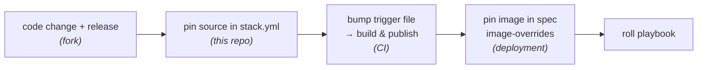

# Development guide — changing, releasing, and deploying images

This guide covers the full lifecycle of a change to any of the container images
the stacks run: from a code edit, through a release and image publish, to it
running in a deployment. The same flow applies to the warp UI, the explorer, the
agents, and the in-repo services; reskinning the warp UI (or the explorer) from
Hyperlane branding to Gorbagana is used as the worked example.

## Where each image comes from

The stacks pull images from `ghcr.io/gorbagana-dev/`. There are three source
patterns, and which one you are dealing with decides the first few steps:

| Image | Source pattern | Where the source lives |
|---|---|---|
| `hyperlane-warp-ui` | **fork** | [`hyperlane-warp-ui-template`](https://github.com/gorbagana-dev/hyperlane-warp-ui-template), pinned in `stack.yml` by release tag |
| `hyperlane-explorer` (frontend) | **fork** | [`hyperlane-explorer`](https://github.com/gorbagana-dev/hyperlane-explorer), pinned in `stack.yml` by release tag |
| `hyperlane-agent`, `hyperlane-scraper` | **fork** | [`hyperlane-monorepo`](https://github.com/gorbagana-dev/hyperlane-monorepo), pinned in `stack.yml` by release tag (carries KMS/S3 endpoint + pruned-slot fixes) |
| `hyperlane-svm-deployer` | **upstream pin** | [`hyperlane-monorepo`](https://github.com/hyperlane-xyz/hyperlane-monorepo), pinned in `stack.yml` by commit (matches the on-chain programs) |
| `hyperlane-kms-proxy`, `hyperlane-gas-oracle` | **in-repo** | [`hyperlane-kms-proxy/`](../hyperlane-kms-proxy/), [`hyperlane-gas-oracle/`](../hyperlane-gas-oracle/) in this repository |

The explorer stack also runs Hasura (`hasura/graphql-engine`) and Postgres as
plain upstream images — wired via config/spec, not built or pinned here.

- **Fork** — we maintain our own branded/modified source in a `gorbagana-dev`
  repo and pin a release tag. Use this when the change is substantial and ongoing
  (a reskin, custom features).
- **Upstream pin** — we build an unmodified upstream commit. Bumping is just
  changing the commit in `stack.yml`.
- **In-repo** — the service source is in this repository; editing it is a normal
  commit here, no external repo or release involved.

## The lifecycle



For **in-repo** images, skip the fork/release steps — edit the service source in
this repo, then bump the trigger file. For **upstream pins**, skip the fork
edit/release — just change the commit in `stack.yml`, then bump the trigger file.

## 1. Make the code change

### Fork-based image (warp UI / explorer)

Work in the fork repository, not here. For a **reskin**, the changes are
typically:

- App branding: name, logo, colours, favicon, fonts (for the warp UI these live
  under the Next.js app's theme/assets and `public/`).
- Copy and metadata: titles, descriptions, links.
- Leave runtime config alone — chain and route config are injected at container
  start by the deployment layer (the warp UI reads `/warpRoutes.yaml` and
  `/chains.yaml` written into its ConfigMap), so branding changes never touch
  the bridge configuration.

Follow the fork's own contribution flow (see its README). Standing rules for our
forks:

- Land changes through **pull requests** into the maintained `gorbagana` branch.
- **Never create git tags locally.** Tags are cut only through the GitHub release
  UI (next step).

### In-repo image (kms-proxy / gas-oracle)

Edit the source under `hyperlane-kms-proxy/` or `hyperlane-gas-oracle/` in this
repository and commit it like any other change. There is no separate release;
the trigger-file bump in step 3 rebuilds the image from the committed source.

### Upstream-pin image (agent / svm-deployer)

No code edit here — only choose the upstream commit you want and set it in step 2.

## 2. Pin the source in `stack.yml`

For fork and upstream-pin images, point the stack at the source you want to
build. Edit `stack_orchestrator/data/stacks/<stack>/stack.yml`:

```yaml
repos:
  # fork — pin the release tag cut in the GitHub UI:
  - github.com/gorbagana-dev/hyperlane-warp-ui-template@v2.0.0-gorbagana.6
  # upstream pin — pin a commit:
  # - github.com/hyperlane-xyz/hyperlane-monorepo@16c056a09af862b3ce9e14bd3b5b8034750af9d0
```

**Cutting a fork release:** in the fork repo's GitHub **Releases → Draft a new
release**, create a tag on the merged `gorbagana` branch following the version
scheme below, and publish. Then set that tag in `stack.yml` here.

### Version scheme

`vX.Y.Z-gorbagana.N`:

- `vX.Y.Z` tracks the upstream version the fork is based on.
- `.N` is our fork iteration on top of that upstream version, incremented each
  release.

Example: `v2.0.0-gorbagana.6` is the 6th Gorbagana release based on upstream
`v2.0.0`.

## 3. Trigger the image build & publish (CI)

Images are built and published by `.github/workflows/publish-images.yml`. It runs
when the matching trigger file changes on `main`, or via manual
`workflow_dispatch`. One trigger file per image:

| Image | Trigger file |
|---|---|
| `hyperlane-svm-deployer` | `.github/trigger-publish-deployer.txt` |
| `hyperlane-agent` | `.github/trigger-publish-agent.txt` |
| `hyperlane-kms-proxy` | `.github/trigger-publish-kms-proxy.txt` |
| `hyperlane-warp-ui` | `.github/trigger-publish-warp-ui.txt` |
| `hyperlane-gas-oracle` | `.github/trigger-publish-gas-oracle.txt` |
| `hyperlane-explorer` | `.github/trigger-publish-explorer.txt` |
| `hyperlane-scraper` | `.github/trigger-publish-scraper.txt` |

Append a dated line describing the change to the relevant trigger file and commit
it together with the `stack.yml` pin, then push to `main`. CI builds **only** the
image(s) whose trigger file changed.

What CI publishes for each image:

- `ghcr.io/gorbagana-dev/<image>:<timestamp>-<shortsha>` — the immutable build
- `ghcr.io/gorbagana-dev/<image>:latest` — moving tag (local dev only; never pin
  a deployment to `latest`)
- **fork-based images** (warp-ui, explorer, agent, scraper): also re-publishes the
  release tag read from `stack.yml` (`vX.Y.Z-gorbagana.N`) so specs can pin the
  human-readable version.

> Fork builds clone the **private** `gorbagana-dev` repos, so those CI jobs
> authenticate the clone with a repo token (`insteadOf` rewrite). A new private
> fork's build job needs the same wiring — see any of the `build-warp-ui` /
> `build-explorer` / `build-scraper` jobs for the pattern.

## 4. Pin the image in the deployment spec

Deployments never follow `latest`. Pin the exact image in the env spec's
`image-overrides`, for every environment you are updating
(`deployment/spec-<stack>.yml`, `deployment/staging/spec-<stack>.yml`):

```yaml
image-overrides:
  warp-ui: ghcr.io/gorbagana-dev/hyperlane-warp-ui:v2.0.0-gorbagana.6
```

For images that don't publish a release tag, pin the `<timestamp>-<shortsha>` tag
CI produced.

## 5. Roll the deployment

Apply the new image with the ops layer. To update one stack in place:

```bash
cd ops
ansible-playbook -i inventories/<env>/hosts.yml playbooks/restart-stack.yml \
  -e stack_name=<stack> -e target_hosts=<inventory group> -e deploy_branch=<branch>
```

`restart-stack.yml` re-renders the on-host spec from `deploy_branch`, syncs the
deployment directory, and rolls the pods (the hosts fetch this repo on
`deploy_branch`, so push the spec/pin change to it first). For a full bring-up use
`deploy-all.yml`. See
[ops/README.md](../ops/README.md) and the env [runbook](../ops/runbooks/) for
exact invocations and inventory names.

## Local iteration (before publishing)

You can build and run an image locally to test a change before cutting a release
or pushing a trigger. From the repo root:

```bash
laconic-so --stack <stack> setup-repositories   # clones the pinned fork/upstream
laconic-so --stack <stack> build-containers     # builds gorbagana-dev/<image>:local
```

This builds the `:local` tag the CI jobs build from. For fork images, this clones
the tag currently pinned in `stack.yml`; to test uncommitted fork work, point the
clone at your branch or build against a local checkout. The warp-ui stack README
has a worked local example.

## Keeping things in sync

When a change adds/removes/renames an env var, ConfigMap, or volume, several files
must move together (compose ↔ spec ↔ test fixture ↔ ops `stack_env_vars`).
`CLAUDE.md` documents the exact keep-in-sync groups — consult it before and after
the change, and update the affected `docs/` accordingly.
