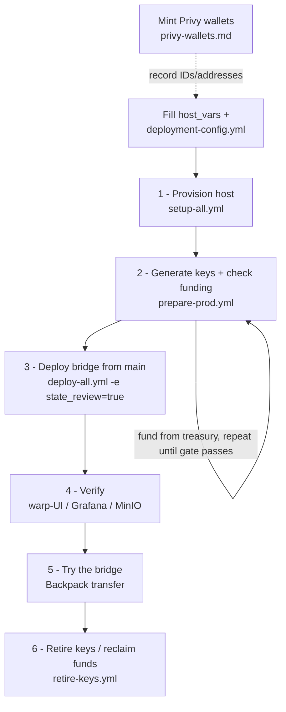

# Production — from-zero deployment

Production runs the bridge against mainnet gorchain (`https://rpc.gorbagana.wtf`) and Helius
mainnet, under `bridge.gorbagana.wtf` (Cloudflare + Let's Encrypt TLS). A single VM
(`bridge-host-1`) runs everything by default, including both validators.

| Host (`host_vars/<host>.yml`) | Runs | Starting spec |
|---|---|---|
| `bridge-host-1` | MinIO, deployer Jobs, both validators, relayer, gas-oracle, monitoring, warp-ui | 4 vCPU / 8 GB / 80 GB SSD or larger |

Multi-host opt-out: to move a validator to a second machine, change that validator's `host:`
in `deployment/bridges/default/operator/validators.yaml`, add the host to
`inventories/prod/hosts.yml` under `validator_hosts:`, and create its `host_vars/` file.

## The whole flow at a glance



Each numbered step below is one command. Steps 0 (prerequisites: VM, Privy, secrets) are
one-time setup; steps 1–6 are the deployment itself.

## 0. Prerequisites

**Controller** — same as `ops/README.md` → "Prerequisites":

```bash
pip install "ansible>=9" ansible-lint yamllint
ansible-galaxy collection install -r requirements.yml -p ./collections
```

**Accounts / access:**

- An SSH key loaded in your agent that can reach the VM and has **write** access to this
  repo on GitHub — the host clones over the forwarded agent (`ansible.cfg` sets
  `ForwardAgent`) and `publish-bridge-state` pushes generated state back over it, so no
  creds land on the VM.
- A Cloudflare API token with DNS edit on the `gorbagana.wtf` zone.
- A Helius **mainnet** project (`helius_api_key` in deployment-config is the mainnet key).
- A Privy app for prod with an oracle server-wallet, a bridge-owner server-wallet, and one
  server-wallet per validator — follow [privy-wallets.md](privy-wallets.md). Mint these now
  and keep the outputs handy; paste them in when you fill `deployment-config.yml` below.

### Host accounts

A bring-your-own prod host needs two accounts set up **before** you run anything, both with
the operator's SSH key in `authorized_keys`:

- **`privileged_user`** — an account with **sudo**. Used only by the one-time bootstrap
  (`setup-all.yml`) to install Docker/kind/kubectl/laconic-so and create `kind_mount_root`.
  Passwordless sudo (`<user> ALL=(ALL) NOPASSWD:ALL` in `/etc/sudoers.d/`) lets the playbooks
  run unattended; otherwise pass `-K` (see step 1).
- **`deploy_user`** — an **unprivileged** account (no sudo required) that runs `laconic-so`
  and every steady-state playbook (deploy/publish/retire). Bootstrap adds it to the `docker`
  group; it needs nothing more. The two can be the same account, but they don't have to be —
  the split exists precisely so the day-to-day deploy account never needs sudo.

The only later command that needs sudo is the teardown wipe (`stop-all.yml -e wipe_data=true`):
it removes root-owned host-path state, so the playbook runs that step as `privileged_user` —
add `-K` if it lacks passwordless sudo.

### Configure inventory + secrets

Fill in exactly two things:

1. `ops/inventories/prod/host_vars/bridge-host-1.yml`: set `public_ip` to the VM's IP, and
   set `privileged_user` / `deploy_user` to the accounts from "Host accounts" above (both
   default to `dev`).
2. The one operator file — every secret and identity value lives here:

   ```bash
   cp ops/inventories/prod/deployment-config.example.yml \
      ops/inventories/prod/deployment-config.yml
   # then fill it in
   ```

   Key fields to fill:
   - `cloudflare_api_token` — DNS edit on `gorbagana.wtf`
   - `privy_app_id`, `privy_app_secret` — your prod Privy app
   - `privy_oracle_wallet_id` — `oracle.json` `id` from privy-wallets.md
   - `helius_api_key` — **mainnet** key (builds `SOLANA_RPC_URL`)
   - `ghcr_pat` — GitHub PAT (packages:read) for private GHCR images
   - `bridge_owner_pubkey`, `igp_oracle_pubkey` — base58 addresses from privy-wallets.md
   - `igp_beneficiary_pubkey` — optional; defaults to `bridge_owner_pubkey`
   - `gorchain_validator_address`, `solana_validator_address` — `0x…` from privy-wallets.md
   - `privy_validator_wallet_ids.gorchain-primary` / `solana-primary` — wallet `id`s
   - `wallet_connect_id` — WalletConnect project id (a dummy value works; Backpack doesn't need it)

`setup-all` fails fast naming any missing value; the deploy gate refuses anything unfilled.

All commands below run from the `ops/` directory:

```bash
cd ops   # from the repo root
```

## 1. Provision the host

```bash
ansible-playbook -i inventories/prod/hosts.yml playbooks/setup-all.yml
# add -K if privileged_user does NOT have passwordless sudo (prompts once for its sudo password)
```

Bootstraps the host (Docker, kind, kubectl, laconic-so), reconciles DNS (all
`bridge.gorbagana.wtf` subdomains point to `bridge-host-1`), and generates + distributes
credentials.

## 2. Key prep + funding

```bash
ansible-playbook -i inventories/prod/hosts.yml playbooks/prepare-prod.yml
```

Installs the Solana CLI on the host, generates the hot signing keys into
`~/.credentials/hyperlane/` (existing keyfiles are never overwritten), distributes each
keyfile to the host whose spec reads it (on single-host this is a no-op), then runs the
funding gate — prints each signer's address + balance gap and **fails listing any shortfalls**.

| Signer | gorchain (SOL) | solana mainnet (SOL) |
|---|---|---|
| deployer | 100 | 10 |
| gorchain validator | 0.1 | — |
| solana validator | — | 0.1 |
| relayer gorchain signer | 1 | — |
| relayer solana signer | — | 1 |
| IGP fee-claim | 1 | 1 |
| Privy IGP oracle | 1 | 1 |
| Privy bridge owner | — | — (transfer target + default fee beneficiary) |

Where these numbers come from — measured per-account consumption, the program-rent
breakdown behind the deployer's spend, and the +~3.3/chain cost of each extra warp
route — is in [funding-estimate.md](funding-estimate.md).

Fund each listed address from a treasury wallet:

1. Run the play. It prints addresses and the balance gap for each underfunded signer, then
   fails.
2. From your treasury wallet, send each signer the listed amount on the correct chain.
3. Re-run the play. Funding is balance-checked; it passes once every signer is at target.

Warp collateral is mainnet USDC (`EPjFWdd5AufqSSqeM2qN1xzybapC8G4wEGGkZwyTDt1v`).

To re-check funding at any time without re-generating keys:

```bash
ansible-playbook -i inventories/prod/hosts.yml playbooks/verify-funding.yml
```

## 3. Deploy the bridge

```bash
ansible-playbook -i inventories/prod/hosts.yml playbooks/deploy-all.yml -e state_review=true
```

`deploy-all.yml` publishes the deployer-generated bridge state (program IDs, agent-config —
secret-free) mid-flight to `deploy_branch`, which for prod **defaults to `main`** (set in
`inventories/prod/group_vars/all.yml`). Deploy from `main` — make sure it's the intended
revision and the host can push to it. To deploy a variant off main, override with
`-e deploy_branch=<branch>`.

A **prod funding gate** runs first (before any stack starts) and aborts the deploy if any
signer is underfunded — same check as `prepare-prod.yml`, but now a hard blocker.

MinIO → deployer Job → warp deployer → **publish bridge state** → relayer → gas-oracle →
warp-ui → validators → monitoring, with deploy gates refusing any unfilled sentinel value.
`state_review=true` pauses the publish to show the staged diff for attended review; drop
the flag for unattended re-runs.

## 4. Verify

The deployment serves these endpoints (all under `bridge.gorbagana.wtf`, Let's Encrypt TLS):

| Service | URL | Credentials / notes |
|---|---|---|
| Warp UI (the bridge) | https://bridge.gorbagana.wtf | — |
| Grafana | https://grafana.bridge.gorbagana.wtf | `admin` / `grafana_admin_password` |
| Prometheus | https://prometheus.bridge.gorbagana.wtf | — |
| MinIO console | https://minio-console.bridge.gorbagana.wtf | `minio_root_user` / `minio_root_password` |
| MinIO S3 API | https://s3.bridge.gorbagana.wtf | validator IAM (per-validator) |
| Relayer | https://relayer.bridge.gorbagana.wtf | Prometheus metrics (feeds Grafana) |
| Gorchain validator | https://validator-gorchain.bridge.gorbagana.wtf | Prometheus metrics (feeds Grafana) |
| Solana validator | https://validator-solana.bridge.gorbagana.wtf | Prometheus metrics (feeds Grafana) |

`grafana_*` / `minio_*` credentials are generated into `deployment-config.yml` by `setup-all`.
The block explorer (`https://explorer.bridge.gorbagana.wtf`) and gorchain RPC
(`https://rpc.gorbagana.wtf`) are **external** — not served by this deployment.

- Warp UI loads and shows the token routes.
- MinIO console: checkpoint objects appear under both validator buckets.
- Grafana: the relayer and both validators report.

## 5. Try the bridge (Backpack)

Use a throwaway test wallet — never the deployer account.

1. **Backpack** (skip if you already use it): install the extension from
   https://backpack.app and create a wallet. Copy its Solana address.
2. **Fund it** — mainnet SOL on gorchain + mainnet SOL on Solana from a treasury, plus
   mainnet USDC (`EPjFWdd5AufqSSqeM2qN1xzybapC8G4wEGGkZwyTDt1v`) for the transfer
   amount.
3. **Point Backpack at the ORIGIN chain** (Settings → your wallet → Solana → RPC
   connection):
   - **forward** (solana mainnet → gorchain): **Custom RPC** → your Helius mainnet URL
     (`https://mainnet.helius-rpc.com/?api-key=<key>`). Avoid the **Mainnet** preset:
     Backpack confirms via the preset's WebSocket before answering the dapp, and public
     endpoints can drop the notification — Backpack then hangs at "Confirming
     Transaction" even though the transfer lands.
   - **reverse** (gorchain → solana mainnet): **Custom RPC** →
     `https://rpc.gorbagana.wtf`
4. Open `https://bridge.gorbagana.wtf`, connect Backpack, pick the direction + amount,
   transfer. **What to expect:** your sending-side balance drops right away; the
   recipient balance takes 30–60 seconds — the funds only exist on the destination once
   the relayer delivers the message. The UI updates on its own and shows a "Recipient
   has received funds" popup at that moment.

## 6. Retire keys (reclaim funds)

Once deployment is complete, reclaim funds from the spent/idle signers back to a treasury:

```bash
ansible-playbook -i inventories/prod/hosts.yml playbooks/retire-keys.yml \
  -e treasury_address=<BASE58> -e confirm_retire=true
```

What it does (confirming each transfer):

- **Deployer key** — one-shot (deploy + ownership handoff done): drained on both chains; the
  (now zero-balance) keyfile is **kept** so a later warp-route deploy can re-fund the same
  address (see [Adding a warp route](#adding-a-warp-route)).
- **Validator announce keys** — idle after the one-time announce (checkpoints are signed via
  the Privy KMS, not an on-chain key): drained on each validator's origin chain, but the
  keyfile is **kept** (the running validator re-reads it on restart; a re-announce — e.g. an S3
  location change — would need a top-up).

Left funded: the **relayer's** per-chain signer keys and the **IGP fee-claim** key — they sign
deliveries and fee claims for the bridge's lifetime. Re-runs are idempotent (already-drained
accounts report "nothing to drain").

**Deploying additional warp routes later** needs a funded deployer key again — see
[Adding a warp route](#adding-a-warp-route).

## Updating a stack

To apply a committed change to one stack (spec edit, image bump, mounted script/config)
without a full redeploy — preserving the cluster and data volumes — use `restart-stack.yml`.
It drives `laconic-so deployment restart`, which re-renders the on-host spec from
`deploy_branch` and rolling-restarts the pods:

```bash
# a singleton stack (name the inventory host group via target_hosts):
ansible-playbook -i inventories/prod/hosts.yml playbooks/restart-stack.yml \
  -e stack_name=hyperlane-warp-ui -e target_hosts=warp_ui_hosts -e deploy_branch=<branch>

# both validators (no target_hosts — they run per-entry from validators.yaml):
ansible-playbook -i inventories/prod/hosts.yml playbooks/restart-stack.yml \
  -e stack_name=hyperlane-validator -e deploy_branch=<branch>
```

`deploy_branch` is required (the host re-fetches the repo on it). Valid `stack_name` values
are the keys of the `stacks` map in `inventories/prod/group_vars/all.yml` (e.g.
`hyperlane-relayer` → `relayer_hosts`, `hyperlane-gas-oracle` → `gas_oracle_hosts`,
`hyperlane-monitoring` → `monitoring_hosts`, `hyperlane-warp-ui` → `warp_ui_hosts`).

## Adding a warp route

To add a warp route to a running bridge — without a full redeploy — edit
`WARP_ROUTES` in `deployment/spec-warp-deployer.yml`, commit + push to `main` (prod's
default deploy branch), and run `update-warp-routes.yml`. Full steps, the route-file
schema, and a worked example are in [warp-routes.md](warp-routes.md).

## 7. Reset

> ⚠️ **This stops a live production bridge.** `stop-all` halts message delivery — in-flight
> transfers are not relayed until the stack is back up.

Stop all stacks (cluster and persisted data preserved):

```bash
ansible-playbook -i inventories/prod/hosts.yml playbooks/stop-all.yml
```

Optional teardown flags (combine as needed):

- `-e destroy_cluster=true` — delete the kind cluster and its in-cluster k8s objects
  (Deployments, Services, Secrets, ConfigMaps). Persisted host-path data **survives**.
- `-e wipe_data=true` — remove the persisted host-path volumes under `/srv/kind/hyperlane`
  (MinIO objects + validator checkpoints, agent data) and the deployment dirs, for a clean
  slate. Keeps `caddy-cert-backup` so `setup-all` needn't re-run. This data is root-owned, so
  the wipe runs as `privileged_user` — add `-K` if it lacks passwordless sudo.

A full wipe is `-e destroy_cluster=true -e wipe_data=true`; rebuilding then means
`setup-all` → `prepare-prod` → `deploy-all`.
