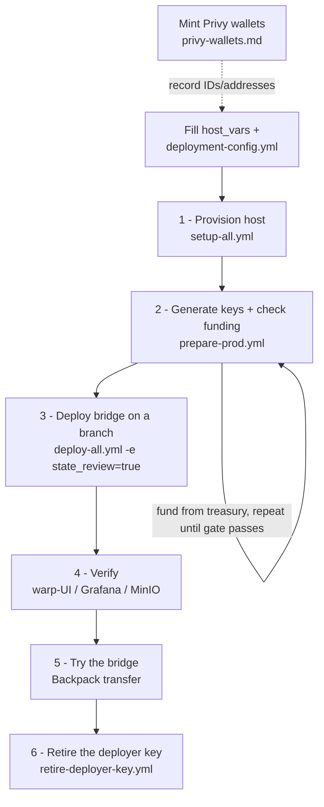

# Production — from-zero deployment

Production runs the bridge against **external mainnet gorchain** (`https://rpc.gorbagana.wtf`)
and **Helius mainnet**, under `bridge.gorbagana.wtf` (Cloudflare + Let's Encrypt TLS). The
operator does **not** run a chain — gorchain is an external network. A single VM (`bridge-host-1`)
runs everything by default, including both validators.

| Host (`host_vars/<host>.yml`) | Runs | Starting spec |
|---|---|---|
| `bridge-host-1` | MinIO, deployer Jobs, both validators, relayer, gas-oracle, monitoring, warp-ui | 4 vCPU / 8 GB / 80 GB SSD or larger |

Multi-host opt-out: to move a validator to a second machine, change that validator's `host:`
in `deployment/bridges/default/operator/validators.yaml`, add the host to
`inventories/prod/hosts.yml` under `validator_hosts:`, and create its `host_vars/` file.

## The whole flow at a glance



Each numbered step below is one command. Steps 0 (prerequisites: VM, Privy, secrets) are
one-time setup; steps 1–6 are the deployment itself.

## 0. Prerequisites

**Controller** — same as `ops/README.md` → "Prerequisites":

```bash
pip install "ansible>=9" ansible-lint yamllint
ansible-galaxy collection install -r requirements.yml -p ./collections
```

**Accounts / access:**

- An SSH key loaded in your agent that can reach the VM and has **write** access to this
  repo on GitHub — the host clones over the forwarded agent (`ansible.cfg` sets
  `ForwardAgent`) and `publish-bridge-state` pushes generated state back over it, so no
  creds land on the VM.
- A Cloudflare API token with DNS edit on the `gorbagana.wtf` zone.
- A Helius **mainnet** project (`helius_api_key` in deployment-config is the mainnet key).
- A Privy app for prod with an oracle server-wallet, a bridge-owner server-wallet, and one
  server-wallet per validator — follow [privy-wallets.md](privy-wallets.md). Mint these now
  and keep the outputs handy; paste them in when you fill `deployment-config.yml` below.

### Configure inventory + secrets

Fill in exactly two things:

1. `ops/inventories/prod/host_vars/bridge-host-1.yml`: set `public_ip` to the VM's IP
   (`privileged_user` and `deploy_user` are already `dev`).
2. The one operator file — every secret and identity value lives here:

   ```bash
   cp ops/inventories/prod/deployment-config.example.yml \
      ops/inventories/prod/deployment-config.yml
   # then fill it in
   ```

   Key fields to fill:
   - `cloudflare_api_token` — DNS edit on `gorbagana.wtf`
   - `privy_app_id`, `privy_app_secret` — your prod Privy app
   - `privy_oracle_wallet_id` — `oracle.json` `id` from privy-wallets.md
   - `helius_api_key` — **mainnet** key (builds `SOLANA_RPC_URL`)
   - `ghcr_pat` — GitHub PAT (packages:read) for private GHCR images
   - `bridge_owner_pubkey`, `igp_oracle_pubkey` — base58 addresses from privy-wallets.md
   - `igp_beneficiary_pubkey` — optional; defaults to `bridge_owner_pubkey`
   - `gorchain_validator_address`, `solana_validator_address` — `0x…` from privy-wallets.md
   - `privy_validator_wallet_ids.gorchain-primary` / `solana-primary` — wallet `id`s
   - `wallet_connect_id` — WalletConnect project id (a dummy value works; Backpack doesn't need it)

`setup-all` fails fast naming any missing value; the deploy gate refuses anything unfilled.

All commands below run from the `ops/` directory:

```bash
cd ops   # from the repo root
```

## 1. Provision the host

```bash
ansible-playbook -i inventories/prod/hosts.yml playbooks/setup-all.yml
```

Bootstraps the host (Docker, kind, kubectl, laconic-so), reconciles DNS (all
`bridge.gorbagana.wtf` subdomains point to `bridge-host-1`), and generates + distributes
credentials. No chain is started — gorchain is external mainnet.

## 2. Key prep + funding

```bash
ansible-playbook -i inventories/prod/hosts.yml playbooks/prepare-prod.yml
```

Installs the Solana CLI on the host, generates the hot signing keys into
`~/.credentials/hyperlane/` (existing keyfiles are never overwritten), distributes each
keyfile to the host whose spec reads it (on single-host this is a no-op), then runs the
funding gate — prints each signer's address + balance gap and **fails listing any shortfalls**.

| Signer | gorchain (SOL) | solana mainnet (SOL) |
|---|---|---|
| deployer | 100 | 10 |
| gorchain validator | 1 | — |
| solana validator | — | 1 |
| relayer gorchain signer | 1 | — |
| relayer solana signer | — | 1 |
| IGP fee-claim | 1 | 1 |
| Privy IGP oracle | 1 | 1 |
| Privy bridge owner | — | — (transfer target + default fee beneficiary) |

**Mainnet has no faucet.** Fund each listed address from a treasury wallet:

1. Run the play. It prints addresses and the balance gap for each underfunded signer, then
   fails.
2. From your treasury wallet, send each signer the listed amount on the correct chain.
3. Re-run the play. Funding is balance-checked; it passes once every signer is at target.

Warp collateral is mainnet USDC (`EPjFWdd5AufqSSqeM2qN1xzybapC8G4wEGGkZwyTDt1v`).

To re-check funding at any time without re-generating keys:

```bash
ansible-playbook -i inventories/prod/hosts.yml playbooks/verify-funding.yml
```

## 3. Deploy the bridge

`deploy-all.yml` publishes deployer-generated state mid-flight, so deploy off a dedicated
branch — **never `main`**. The host fetches the repo on that branch, so create and push
it first, then pass it as `deploy_branch` (a forgotten flag fails up front instead of
publishing bridge state to main):

```bash
BRANCH=<deploy-branch>   # any name except main, e.g. prod-deploy

git checkout -b "$BRANCH" && git push -u origin "$BRANCH"

ansible-playbook -i inventories/prod/hosts.yml playbooks/deploy-all.yml \
  -e deploy_branch="$BRANCH" -e state_review=true
```

A **prod funding gate** runs first (before any stack starts) and aborts the deploy if any
signer is underfunded — same check as `prepare-prod.yml`, but now a hard blocker.

MinIO → deployer Job → warp deployer → **publish bridge state** → relayer → gas-oracle →
warp-ui → validators → monitoring, with deploy gates refusing any unfilled sentinel value.
`state_review=true` pauses the publish to show the staged diff for attended review; drop
the flag for unattended re-runs.

## 4. Verify

- Warp UI at `https://bridge.gorbagana.wtf` loads and shows the token routes.
- MinIO console at `https://minio-console.bridge.gorbagana.wtf` (log in with
  `minio_root_user` / `minio_root_password`, generated into `deployment-config.yml` by
  `setup-all`): checkpoint objects appear under both validator buckets.
- Grafana at `https://grafana.bridge.gorbagana.wtf` (`admin` / `grafana_admin_password`
  from the same file): relayer + validator dashboards report.
- Relayer metrics at `https://relayer.bridge.gorbagana.wtf/metrics` answer.
- Explorer at `https://explorer.bridge.gorbagana.wtf`.

## 5. Try the bridge (Backpack)

Use a throwaway test wallet — never the deployer account.

1. **Backpack** (skip if you already use it): install the extension from
   https://backpack.app and create a wallet. Copy its Solana address.
2. **Fund it** — mainnet SOL on gorchain + mainnet SOL on Solana from a treasury, plus
   mainnet USDC (`EPjFWdd5AufqSSqeM2qN1xzybapC8G4wEGGkZwyTDt1v`) for the transfer
   amount.
3. **Point Backpack at the ORIGIN chain** (Settings → your wallet → Solana → RPC
   connection):
   - **forward** (solana mainnet → gorchain): **Custom RPC** → your Helius mainnet URL
     (`https://mainnet.helius-rpc.com/?api-key=<key>`). Avoid the **Mainnet** preset:
     Backpack confirms via the preset's WebSocket before answering the dapp, and public
     endpoints can drop the notification — Backpack then hangs at "Confirming
     Transaction" even though the transfer lands.
   - **reverse** (gorchain → solana mainnet): **Custom RPC** →
     `https://rpc.gorbagana.wtf`
4. Open `https://bridge.gorbagana.wtf`, connect Backpack, pick the direction + amount,
   transfer. **What to expect:** your sending-side balance drops right away; the
   recipient balance takes 30–60 seconds — the funds only exist on the destination once
   the relayer delivers the message. The UI updates on its own and shows a "Recipient
   has received funds" popup at that moment.

## 6. Retire the deployer key

Once deployment is complete, drain and remove the deployer key on-box. The deployer is a
completed Job; removing its keyfile does not affect the running relayer or validators
(their keyfiles stay — deployment restart re-reads them).

```bash
ansible-playbook -i inventories/prod/hosts.yml playbooks/retire-deployer-key.yml \
  -e treasury_address=<BASE58> -e confirm_retire=true
```

The play drains the deployer balance to `treasury_address`, archives the keyfile to
`.deployer-key-archive/` on your operator machine (gitignored), and removes it on-box.

**Re-deploying additional warp routes later** requires a funded deployer key again — import
the archived keyfile back onto the host first.

## 7. Reset

Stop all stacks (chain state is external — nothing chain-side to reset):

```bash
ansible-playbook -i inventories/prod/hosts.yml playbooks/stop-all.yml
```

Full host reset additionally destroys the kind cluster (`-e destroy_cluster=true`). Chain
state and gorchain block history are external and unaffected by any playbook.
