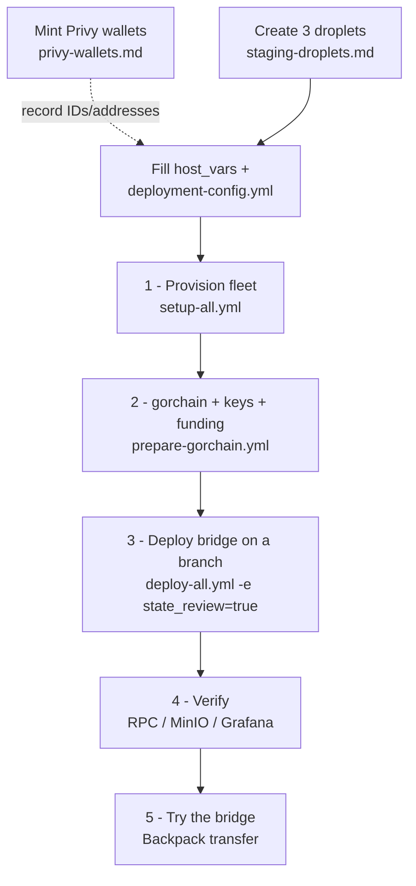

# Staging — from-zero deployment

Staging is the prod rehearsal ground: Solana **devnet** (Helius) + a
persistent single-node **gorchain**, on three VMs, with real Cloudflare DNS
and Let's Encrypt TLS under `staging.gorbagana.wtf`.

| Host (`host_vars/<host>.yml`) | Runs | Starting spec | DO size slug |
|---|---|---|---|
| `staging-bridge-ops` | MinIO, deployer Jobs, relayer, gas-oracle, monitoring, warp-ui | 4 vCPU / 8 GB / 80 GB SSD | `s-4vcpu-8gb` |
| `staging-gorchain` | gorchain chain + Caddy RPC front | 8 vCPU / 32 GB / 500 GB NVMe SSD | `s-8vcpu-32gb-640gb-intel` |
| `staging-hyperlane-validators` | both hyperlane validators | 4 vCPU / 8 GB / 60 GB SSD | `s-4vcpu-8gb` |

Both validators live off the chain host: staging-gorchain's ports 80/443
belong to the gorchain RPC Caddy front, so the validators' kind ingress
(Caddy + Let's Encrypt) needs its own machine.

## The whole flow at a glance



Each numbered step below is one command. Steps 0 (prerequisites: droplets,
Privy, secrets) are one-time setup; steps 1–5 are the deployment itself.
**Tested end-to-end with the [Backpack](https://backpack.app) wallet.**

## 0. Prerequisites

**Controller** — same as `ops/README.md` → "Prerequisites":

```bash
pip install "ansible>=9" ansible-lint yamllint
ansible-galaxy collection install -r requirements.yml -p ./collections
# re-run the collection install after pulling — prepare-gorchain needs community.docker
```

**Accounts / access:**

- `doctl` installed and authenticated (`doctl auth init`).
- An SSH key loaded in your agent that can reach the VMs and has **write**
  access to this repo on GitHub — the hosts clone over the forwarded agent
  (`ansible.cfg` sets `ForwardAgent`) and `publish-bridge-state` pushes the
  generated state back over it, so no creds land on the VMs.
- A Cloudflare API token with DNS edit on the `gorbagana.wtf` zone.
- A Helius **devnet** project (separate key from prod).
- A Privy app for staging with an oracle server-wallet, a bridge-owner
  server-wallet, and one server-wallet per validator — follow
  [privy-wallets.md](privy-wallets.md). You **mint these now** but **record the
  IDs/addresses later**, in the `deployment-config.yml` created below — that
  file doesn't exist yet, so just keep the Privy outputs handy.

### Create the three VMs

Create the three droplets from the table above following
[**staging-droplets.md**](staging-droplets.md) (doctl: SSH key, cloud-init `dev`
user, the create loop, IP harvesting). When you can `ssh dev@<ip>` into all
three, come back here.

### Configure inventory + secrets

Fill in exactly two things:

1. `ops/inventories/staging/host_vars/<host>.yml` (one per VM in the table
   above): `public_ip` (from the droplet list above), `privileged_user`,
   `deploy_user` (both already `dev`).
2. The one operator file — every other value (secrets, the Privy
   IDs/addresses, the WalletConnect id) lives here, each key commented:

   ```bash
   cp ops/inventories/staging/deployment-config.example.yml \
      ops/inventories/staging/deployment-config.yml
   # then fill it in
   ```

`setup-all` fails fast naming any missing value; the deploy gates refuse
anything left unfilled.

All commands below run from the `ops/` directory:

```bash
cd ops   # from the repo root
```

## 1. Provision the fleet

```bash
ansible-playbook -i inventories/staging/hosts.yml playbooks/setup-all.yml
```

Bootstraps all three hosts (Docker, kind, kubectl, laconic-so), reconciles
DNS (including `rpc.staging.gorbagana.wtf` → staging-gorchain), and
generates+distributes credentials.

## 2. Stand up gorchain (persistent) + hot keys

```bash
ansible-playbook -i inventories/staging/hosts.yml playbooks/staging/prepare-gorchain.yml
```

Brings up the single-node gorchain via gorchain-stacks (state in
`~/chains/gorchain` on the chain host — re-runs preserve it), starts the
Caddy TLS front for `rpc.staging.gorbagana.wtf`, generates the hot signing
keys into `~/.credentials/hyperlane/` on staging-gorchain, copies each
keyfile to the host whose spec reads it, and funds every on-chain signer —
no SSH-ing anywhere:

| Host | Keyfiles |
|---|---|
| `staging-bridge-ops` | `deployer-keypair.json`, `relayer-gorchain.key`, `relayer-solana.key`, `relayer-fee-claim.json` |
| `staging-hyperlane-validators` | `validator-gorchain.key`, `validator-solana.key` |

Staging signs from generated throwaway key files; prod signs from
operator-provisioned key files. The bridge owner is not a keyfile on any env:
at the end of the deploy, program upgrade authority and mailbox/ISM/route
ownership transfer to `BRIDGE_OWNER_PUBKEY` — the Privy bridge-owner wallet,
which signs nothing during deployment.

### Funding the signers (expect to do the devnet side by hand)

The play funds each signer to its target balance (`fund-staging-signers.sh`,
driven by the generated `addresses.env` + `igp_oracle_pubkey` from
deployment-config). Balance-driven and idempotent — re-runs only top up:

| Signer | gorchain (SOL) | solana devnet (SOL) |
|---|---|---|
| deployer | 100 | 10 |
| gorchain validator | 1 | — |
| solana validator | — | 1 |
| relayer gorchain signer | 1 | — |
| relayer solana signer | — | 1 |
| IGP fee-claim | 1 | 1 |
| Privy IGP oracle | 1 | 1 |
| Privy bridge owner | — | — (transfer target + default fee beneficiary) |

The gorchain side funds from gorchain's own faucet automatically. **The Solana
devnet side will not** — the public devnet faucet rate-limits and blocks
datacenter/VM IPs, so the in-play airdrops fail from the staging box. This is
expected; fund those addresses yourself:

1. Run the play. It funds gorchain, then **fails listing the underfunded devnet
   addresses** (the deployer, solana validator, relayer-solana, fee-claim, and
   oracle ed25519 pubkeys).
2. From your **own machine** (not the VM), fund each listed address with the
   target amount above — paste it into the faucet at https://faucet.solana.com
   (devnet), or `solana transfer --url devnet <address> <amount>` from a personal
   devnet wallet.
3. Re-run the play. Funding is balance-driven, so it only adds the remaining gap
   and passes once every signer is at target.

Warp collateral is Circle's devnet USDC
(`4zMMC9srt5Ri5X14GAgXhaHii3GnPAEERYPJgZJDncDU`) — faucet at
https://faucet.circle.com for transfer tests.

## 3. Deploy the bridge

`deploy-all.yml` publishes the deployer-generated state mid-flight, so deploy
off a dedicated branch — **never `main`**. The hosts fetch the repo on that
branch, so create and push it first, then pass it as `deploy_branch` (a
forgotten flag fails up front instead of publishing bridge state to main):

```bash
BRANCH=<deploy-branch>   # any name except main, e.g. staging-deploy

git checkout -b "$BRANCH" && git push -u origin "$BRANCH"

ansible-playbook -i inventories/staging/hosts.yml playbooks/deploy-all.yml \
  -e deploy_branch="$BRANCH" -e state_review=true
```

MinIO → deployer Job → warp deployer → **publish bridge state** → relayer →
gas-oracle → warp-ui → validators → monitoring, with the deploy gates
refusing any unfilled placeholder. The publish (commit + push of the
deployer-generated state to `deploy_branch`) happens mid-flight —
`state_review=true` pauses it to show the staged diff for an attended review;
drop the flag for unattended re-runs.
`playbooks/publish-bridge-state.yml` exists standalone only for re-publishing
outside a full deploy.

## 4. Verify

- `https://rpc.staging.gorbagana.wtf/health` answers `ok` and slots advance.
- MinIO (`https://minio-console.staging.gorbagana.wtf` — log in with
  `minio_root_user` / `minio_root_password`, generated into the inventory's
  `deployment-config.yml` by setup-all): checkpoint objects appear under both
  validator buckets.
- Grafana (`https://grafana.staging.gorbagana.wtf` — `admin` /
  `grafana_admin_password` from the same file): relayer + validator
  dashboards report.
- `https://staging.gorbagana.wtf`: run a devnet-USDC transfer
  solana → gorchain and back — see the next section.

## 5. Try the bridge (Backpack)

Use a throwaway test wallet — never the deployer account.

1. **Backpack** (skip if you already use it): install the extension from
   https://backpack.app and create a wallet (or import a dedicated test
   seed). Copy its Solana address.
2. **Fund it** — GOR on gorchain + devnet SOL, balance-driven and idempotent:

   ```bash
   ansible-playbook -i inventories/staging/hosts.yml playbooks/fund-test-wallet.yml -e wallet=<address>
   ```

   This funds GOR from gorchain's faucet, then **fails on the devnet SOL leg**
   (`✗ SOL: have 0 SOL, want 2 — top up and re-run`) — the public devnet faucet
   blocks the staging box's datacenter IP. That's expected: from **your own
   machine**, fund the wallet's devnet SOL — paste the address into
   https://faucet.solana.com (devnet), or `solana transfer --url devnet <address> 2`
   from a personal wallet — then re-run the play (it's balance-driven and passes
   once the wallet is at target). **Devnet USDC** comes from Circle:
   https://faucet.circle.com → token USDC, network **Solana Devnet**, the same
   address.
3. **Point Backpack at the transfer's ORIGIN chain** (Settings → your
   wallet → Solana → RPC connection) — the wallet must broadcast on the
   chain you are sending FROM:
   - **forward** (solana devnet → gorchain): **Custom RPC** → a Helius
     devnet URL (`https://devnet.helius-rpc.com/?api-key=<key>` — your own
     key; it stays in your local wallet config). Avoid the **Devnet**
     preset (`api.devnet.solana.com`): Backpack confirms its own
     submission via that RPC's WebSocket before answering the dapp, and
     the public endpoint drops the notification — Backpack then hangs at
     "Confirming Transaction" and the UI sticks at "Sign transfer
     transaction in Backpack" even though the transfer lands (the
     "Recipient has received funds" toast still fires).
   - **reverse** (gorchain → solana devnet): **Custom RPC** →
     `https://rpc.staging.gorbagana.wtf`
4. Open `https://staging.gorbagana.wtf`, connect Backpack, pick the
   direction + amount, transfer. **What to expect:** your sending-side
   balance drops right away; the recipient balance takes 30–60 seconds —
   the funds only exist on the destination once the relayer delivers the
   message. The UI updates on its own (no refresh) and shows a
   "Recipient has received funds" popup at that moment. To see the
   destination balance in Backpack too, switch the RPC per step 3.

## 6. Reset

Stacks only (chain + state survive):

```bash
ansible-playbook -i inventories/staging/hosts.yml playbooks/stop-all.yml
```

Full host reset before a bootstrap rehearsal additionally destroys the kind
cluster (`-e destroy_cluster=true`) and, **only if intentionally resetting
chain state**, removes `~/chains/gorchain` + the `gorchain-rpc-caddy`
container on staging-gorchain by hand. Chain state is deliberately never
destroyed by a playbook.

Scorched earth — destroy the VMs themselves (chain state and all): see
[staging-droplets.md → Teardown](staging-droplets.md#teardown).
